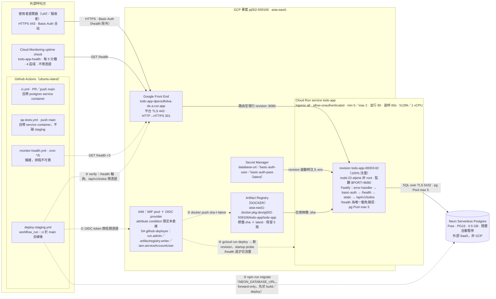
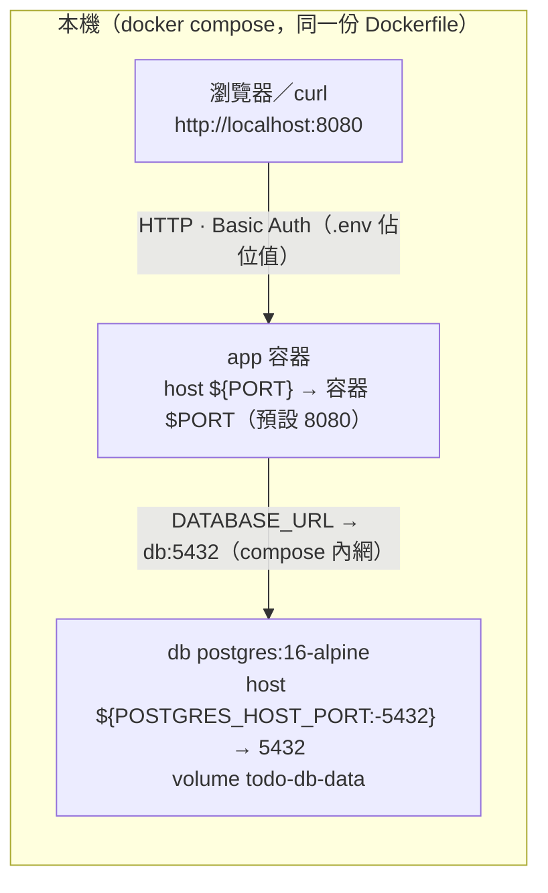

# 網路架構圖（E-001 staging 現況，2026-09-20）

> 本報告是給人閱讀的檢視，不是事實來源。所有數值取自上方 `sources` 所列檔案；prod 環境本 Epic 不建立。
> 圖形版（含連線清單表）：`docs/reports/20260920-1613-網路架構圖.html`；線上版 Artifact：https://claude.ai/artifact/LA48PrBcX9L5RQuBH7cmjj

## 1. staging：GCP Cloud Run 執行路徑與 GitHub Actions 交付路徑

實線＝執行期流量；虛線＝交付流程（①→⑤ 順序固定）。

## 2. dev：本機 docker compose

- `npm start` 模式：app 不在容器內，`DATABASE_URL` 改指 `localhost:${POSTGRES_HOST_PORT:-5432}`。
- CI 的 `ci.yml`／`qa-tests.yml` 用同一拓樸（postgres service container），完全不接 staging。

## 3. 連線清單

| 來源 | 目的 | 協定／埠 | 認證 | 頻率或觸發 |
|---|---|---|---|---|
| 使用者瀏覽器 | GFE → Cloud Run `todo-app` | HTTPS 443（容器 8080） | Basic Auth 單一共享帳密 | UAT 手動操作 |
| Cloud Monitoring uptime check | `/health` | HTTPS 443 | 無（唯一豁免路徑） | 每 5 分鐘 × 4 區域（asia-pacific／usa-oregon／usa-iowa／europe） |
| monitor-health.yml | `/health` | HTTPS 443 | 無 | cron `*/5`，每次 3 筆，間隔 20 秒；備援 |
| deploy-staging.yml ① | GCP STS／WIF | HTTPS（OIDC token） | GitHub OIDC，限定本倉庫 | ci 於 main 全綠後 |
| deploy-staging.yml ② | Neon | Postgres over TLS 5432 | `NEON_DATABASE_URL`（GitHub secret） | 同上；forward-only migration |
| deploy-staging.yml ③ | Artifact Registry | HTTPS（docker push） | SA 短期憑證 | 同上；標籤 sha ＋ latest |
| deploy-staging.yml ④ | Cloud Run Admin API | HTTPS（gcloud run deploy） | SA 短期憑證 | 同上；startup probe 通過才切流量 |
| deploy-staging.yml ⑤ | `/health`、`/api/v1/todos` | HTTPS 443 | 後者帶 Basic Auth | 同上；輪詢上限 5 分鐘 |
| Cloud Run revision | Neon | Postgres over TLS 5432 | `DATABASE_URL`（Secret Manager） | 常駐連線池 max 5 |
| Cloud Run | Artifact Registry | 平台內部拉取映像 | 平台身分 | 建立 revision 時 |
| Cloud Run | Secret Manager | 平台內部 | SA `secretmanager.secretAccessor` | revision 啟動時注入三個 env |
| dev 瀏覽器／curl | app 容器 | HTTP localhost 8080 | Basic Auth（.env 佔位值） | 本機 |
| dev app 容器 | db 容器 | Postgres 5432（compose 內網） | .env 佔位值 | 本機 |

## 4. 設計要點（為何長這樣）

- **平台層不擋、應用層擋**：Cloud Run 以 `--allow-unauthenticated` 開放，全站 Basic Auth 由 Fastify 全域 hook 實作，`/health` 是唯一豁免路徑，否則監測永遠 401（ADR-0004）。
- **同源部署、不啟用 CORS**：前端 `public/` 與 `/api/v1/*` 由同一個 Cloud Run 服務供應，`CORS_ALLOWED_ORIGINS` 留空（ADR-0004、BR-015）。
- **倉庫零長期金鑰**：GitHub Actions 以 WIF 換短期憑證；三個機密只存在 Secret Manager 與 GitHub secrets（ADR-0005、06 §3.2.1）。
- **資料庫在 GCP 之外**：Neon Free 與運算實例分離，重部署與回滾不觸碰資料；Cloud Run → Neon 走公網 TLS（ADR-0002）。
- **`min-instances = 0`** 是免費額度的必要條件，冷啟 1–3 秒是刻意承擔的代價；uptime check 兼保溫。
- **NFR-003 採樣**：以 Cloud Monitoring uptime check 為主要來源（起算 2026-09-19T17:55:07+08:00），GitHub cron 降為備援（06 §6.8、工作鐵則）。
- **prod 環境本 Epic 不建立**。
