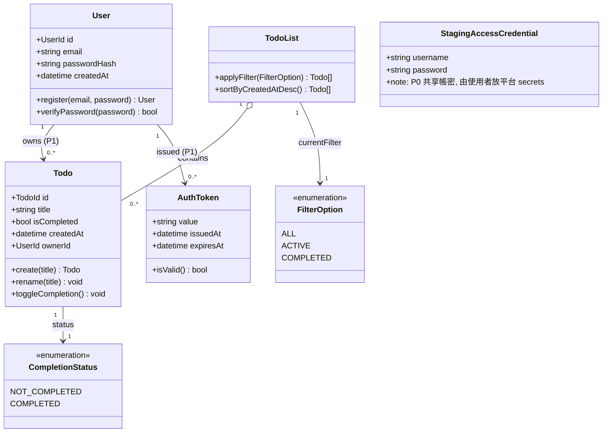
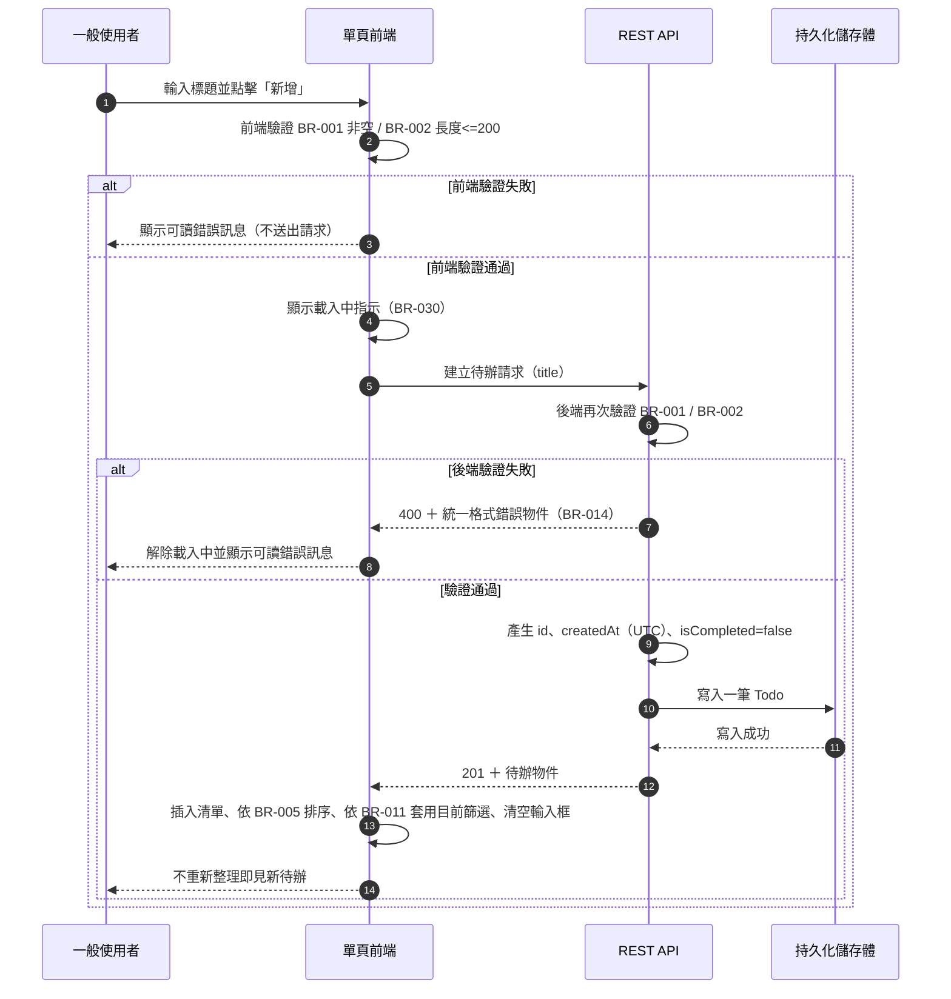
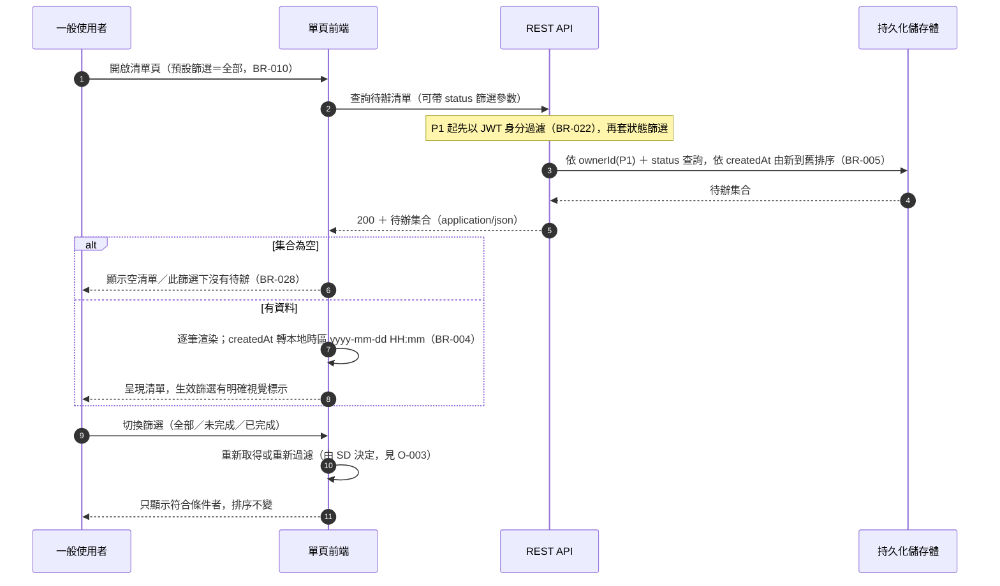
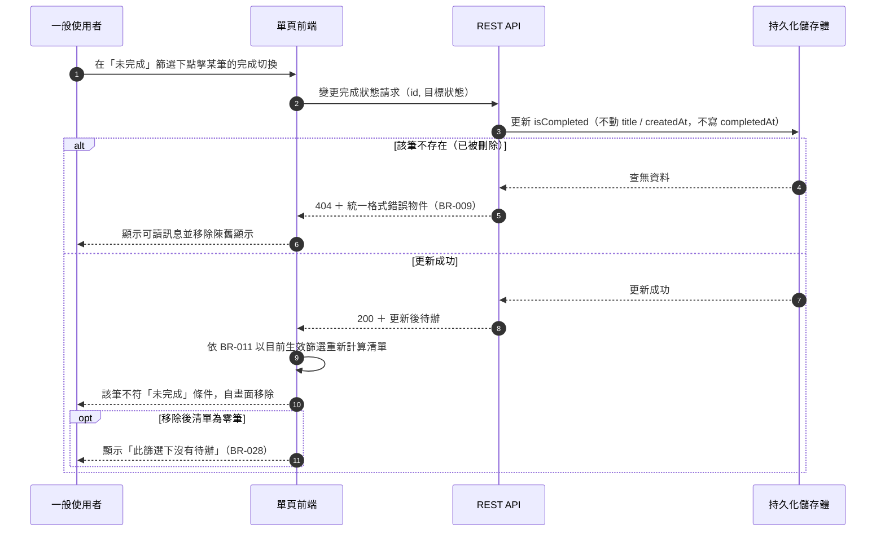
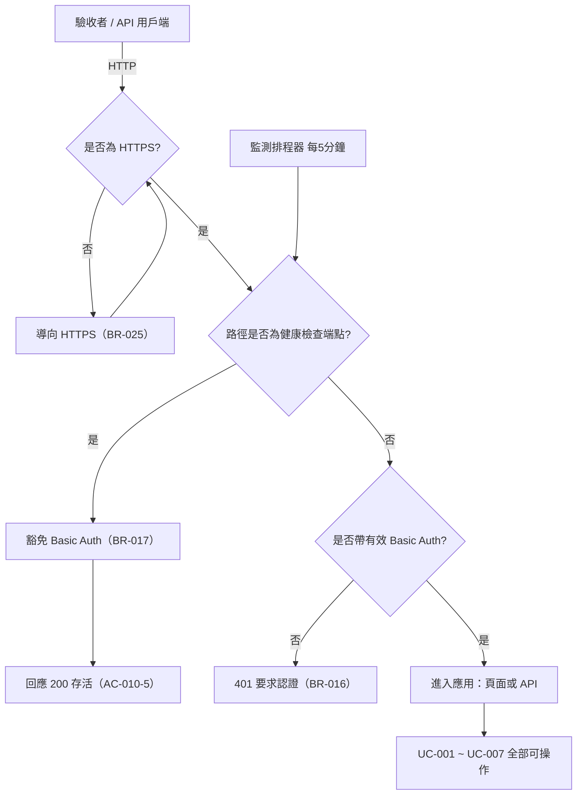
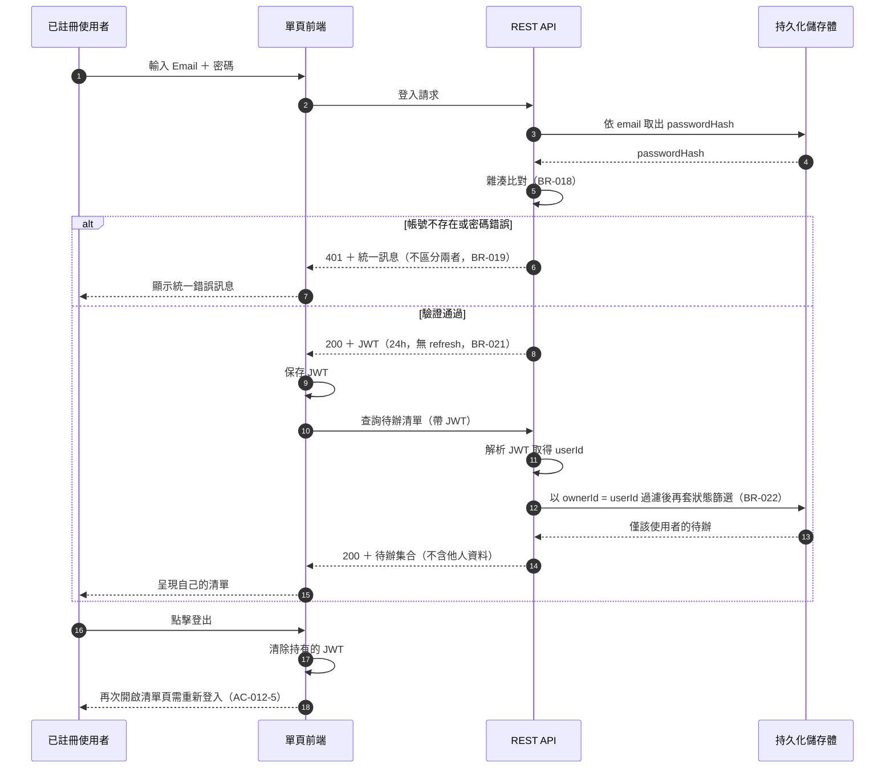

# 系統分析書（SA）：E-001 待辦事項 Web 應用

輸入：`docs/specs/01_需求規格書_SRS.md`（13 則 US、62 條 AC、8 條 NFR）、`docs/specs/01a_需求澄清紀錄.md`、`tasks/E-001-todo-app.md#Leader 裁決紀錄`（Q-001~Q-011 全部裁決）。
每個使用案例必須追溯到 US-ID；每條驗收條件（AC）至少被一個 UC 的流程覆蓋，覆蓋對照見附錄 A。

**本書的定位**：回答「系統要做什麼」，不回答「用什麼技術做」。技術選型（語言、框架、資料庫、雲端平台、端點路徑、欄位命名）由 plan-sd 於 `docs/specs/03_*`／`04_*` 與 ADR 決定。
本書已把 Leader 對 Q-001~Q-011 的裁決值寫成業務規則（第 5 章），plan-sd 可直接引用，不需回頭查澄清紀錄。

**閱讀順序建議（給 plan-sd）**：第 3 章領域模型（畫 ERD）→ 第 1、2 章使用案例（推導端點）→ 第 5 章業務規則（驗證邏輯）→ 第 7 章未決事項（你要決定的事）。

---

## 1. 使用案例總覽

角色定義（沿用 SRS §1）：
- **一般使用者（User）**：以瀏覽器管理自己的待辦事項。
- **用戶端開發者（API Consumer）**：以非瀏覽器用戶端（curl、未來的行動 App）呼叫 REST API。
- **驗收者（UAT）**：於 staging 以瀏覽器逐條驗收 P0 使用者故事。
- **監測排程器（Monitor）**：定時呼叫健康檢查端點以量測 NFR-003 的系統角色（非人類）。

| UC-ID | 名稱 | 主要角色 | 對應 US | 優先級 | 類型 |
|---|---|---|---|---|---|
| UC-001 | 新增待辦 | 一般使用者 | US-001 | P0 | 資料異動 |
| UC-002 | 檢視待辦清單 | 一般使用者 | US-002 | P0 | 資料查詢 |
| UC-003 | 編輯待辦標題 | 一般使用者 | US-003 | P0 | 資料異動 |
| UC-004 | 刪除待辦 | 一般使用者 | US-004 | P0 | 資料異動 |
| UC-005 | 切換完成／未完成 | 一般使用者 | US-005 | P0 | 資料異動 |
| UC-006 | 依狀態篩選清單 | 一般使用者 | US-006 | P0 | 資料查詢 |
| UC-007 | 檢視待辦建立時間 | 一般使用者 | US-007 | P0 | 資料查詢 |
| UC-008 | 於單一頁面完成全部待辦操作 | 一般使用者 | US-008 | P0 | **操作情境** |
| UC-009 | 以 REST API 完成全部待辦操作 | 用戶端開發者 | US-009 | P0 | 介面契約 |
| UC-010 | 於 staging 環境驗收 | 驗收者 | US-010 | P0 | **操作情境** |
| UC-011 | 監測服務存活 | 監測排程器 | US-010（AC-010-5）、NFR-003 | P0 | 系統對系統 |
| UC-012 | 使用者註冊 | 一般使用者 | US-011 | P1 | 資料異動 |
| UC-013 | 使用者登入與登出 | 一般使用者 | US-012 | P1 | 認證 |
| UC-014 | 以使用者身分隔離存取待辦 | 一般使用者 | US-013 | P1 | 授權 |

**覆蓋聲明**：13 則 US 全部至少對應一個 UC（US-010 對應 UC-010 與 UC-011 兩個）；62 條 AC 全部被覆蓋（附錄 A）。無孤兒 US、無孤兒 UC。

**兩個「操作情境型」UC 的說明**（UC-008、UC-010）：
這兩則 US 不是「使用者對某筆資料做一件事」，而是「使用者在某個環境下把一串事做完」。若硬套資料流會寫成空殼，因此改以**操作序列 + 環境前置條件 + 可觀察狀態**描述。它們的價值在於：UC-008 定義了前端的單頁互動契約（不整頁跳轉、載入中指示、錯誤呈現），UC-010 定義了驗收環境的可用性契約（HTTPS、資料跨部署存續、文件可重現）。plan-sd 可從 UC-008 推導前端狀態機、從 UC-010 推導部署與環境檢查清單。

---

## 2. 使用案例描述

> 說明：各 UC 的「輸入／輸出」欄是**語意層**描述（要什麼資料、回什麼資料），不指定 HTTP 方法與路徑；plan-sd 據此推導端點。
> P0 階段所有 UC 的隱含前置條件：請求已通過 staging 的全站 Basic Auth（BR-016）。P1 上線後由 JWT 取代（BR-020）。

### UC-001 新增待辦

- 角色：一般使用者
- 前置條件：使用者已開啟清單頁；頁面已完成載入。
- 觸發：使用者在新增輸入框輸入標題後點擊「新增」。
- 輸入／輸出（供 SD 推導端點）：
  - 輸入：標題（字串）。
  - 輸出：新建立的待辦（識別碼、標題、完成狀態＝未完成、建立時間）。
- 主要流程：
  1. 使用者在新增輸入框輸入非空白標題。
  2. 使用者以滑鼠點擊「新增」按鈕。
  3. 前端依 BR-001、BR-002 做即時驗證，通過後送出建立請求，並顯示載入中指示（BR-030）。
  4. 後端再次驗證 BR-001、BR-002（前端驗證可被繞過）。
  5. 後端產生唯一識別碼與建立時間（BR-003、BR-004），完成狀態設為「未完成」（BR-006），寫入儲存體。
  6. 後端回傳建立成功與該筆待辦內容。
  7. 前端不重新整理頁面，將新待辦插入目前清單並依 BR-005 排序、依 BR-011 套用目前篩選；清空新增輸入框。
- 替代／例外流程：
  - E1（標題為空或全為空白字元）：前端不送出請求，於畫面顯示可讀錯誤訊息（例：標題不可為空）；若請求仍到達後端（繞過前端），後端回輸入驗證失敗並附統一格式錯誤物件（BR-001、BR-014），系統不建立任何待辦。
  - E2（標題長度超過 200 字元）：同 E1 的處理路徑，錯誤訊息為長度超過上限（BR-002）。
  - E3（後端無回應或回伺服器錯誤）：前端解除載入中指示，顯示可讀錯誤訊息，清單維持原狀不插入假資料（BR-029、BR-030）。
  - E4（標題含 HTML 或腳本片段）：正常建立，但顯示時一律逸出，不得執行（BR-013）。
- 後置條件：儲存體多一筆待辦，狀態為未完成，建立時間為建立當下；清單頁已呈現該筆。
- 對應驗收條件：AC-001-1、AC-001-2、AC-001-3、AC-001-4、AC-001-5

### UC-002 檢視待辦清單

- 角色：一般使用者
- 前置條件：使用者可存取應用網址。
- 觸發：使用者開啟或重新整理清單頁。
- 輸入／輸出：
  - 輸入：無（P1 起隱含使用者身分）；可選的狀態篩選參數（見 UC-006）。
  - 輸出：待辦集合，每筆含識別碼、標題、完成狀態、建立時間。
- 主要流程：
  1. 使用者開啟清單頁。
  2. 前端顯示載入中指示並向後端查詢待辦清單。
  3. 後端自儲存體讀取待辦，依 BR-005 以建立時間新到舊排序後回傳（P1 起先依 BR-022 以使用者身分過濾）。
  4. 前端逐筆渲染，每筆至少顯示標題、完成狀態、建立時間（建立時間格式見 BR-004）。
- 替代／例外流程：
  - E1（沒有任何待辦）：回傳空集合；前端顯示可讀的空清單提示，不顯示錯誤、不顯示空白畫面（BR-028）。
  - E2（查詢失敗，後端 5xx 或連線中斷）：前端解除載入中指示並顯示可讀錯誤訊息，不停留在空白或凍結狀態（BR-029）。
  - E3（清單筆數達容量上限規模，500 筆）：仍須完整回傳且符合 NFR-007 的時間門檻；本輪不分頁（範圍外，BR-027）。
- 後置條件：畫面呈現的清單內容與儲存體一致；重新整理後資料仍在（資料已持久化，NFR-006）。
- 對應驗收條件：AC-002-1、AC-002-2、AC-002-3、AC-002-4

### UC-003 編輯待辦標題

- 角色：一般使用者
- 前置條件：清單中至少有一筆待辦，且該筆目前存在於儲存體。
- 觸發：使用者點擊某筆的「編輯」。
- 輸入／輸出：
  - 輸入：待辦識別碼、新標題。
  - 輸出：更新後的待辦（標題已變更，建立時間與完成狀態不變）。
- 主要流程：
  1. 使用者點擊該筆的「編輯」，該筆進入編輯狀態並顯示可輸入的標題欄位。
  2. 使用者輸入新的非空白標題。
  3. 使用者點擊「儲存」。
  4. 前端依 BR-001、BR-002 驗證後送出更新請求；後端再次驗證（BR-012：僅標題可編輯，其他欄位即使被送出也不採用）。
  5. 後端更新標題，**不改動建立時間與完成狀態**（BR-003、BR-012），回傳更新後內容。
  6. 前端離開編輯狀態，就地更新該筆顯示，不重新整理頁面。
- 替代／例外流程：
  - E1（標題被清空或只剩空白字元）：系統不更新，顯示可讀錯誤訊息，該筆維持原標題（BR-001）。
  - E2（使用者點擊「取消」）：離開編輯狀態，該筆維持原標題，不送出任何請求。
  - E3（該筆已被刪除或識別碼不存在）：後端回「找不到資源」（BR-009），前端顯示可讀訊息，**不得因此新增一筆資料**；建議前端一併移除該筆的陳舊顯示。
  - E4（標題超過 200 字元）：同 E1 路徑，訊息為長度超過上限（BR-002）。
- 後置條件：該筆標題已更新並持久化；其識別碼、建立時間、完成狀態不變。
- 對應驗收條件：AC-003-1、AC-003-2、AC-003-3、AC-003-4、AC-003-5

### UC-004 刪除待辦

- 角色：一般使用者
- 前置條件：清單中至少有一筆待辦。
- 觸發：使用者點擊某筆的「刪除」。
- 輸入／輸出：
  - 輸入：待辦識別碼。
  - 輸出：刪除成功的結果（無內容或成功訊息）。
- 主要流程：
  1. 使用者點擊該筆的「刪除」。
  2. 系統顯示二次確認提示（BR-008）。
  3. 使用者確認。
  4. 前端送出刪除請求；後端自儲存體**硬刪除**該筆（BR-008：資料不保留、不可復原）。
  5. 後端回傳刪除成功。
  6. 前端不重新整理頁面，將該筆自清單移除。
- 替代／例外流程：
  - E1（使用者在確認提示選擇取消）：不送出請求，該筆仍在清單中。
  - E2（該筆已被刪除或識別碼不存在）：後端回「找不到資源」（BR-009），前端顯示可讀訊息且**不得出現系統錯誤畫面**；建議一併移除陳舊顯示。
  - E3（刪除請求失敗，5xx 或斷線）：前端顯示可讀錯誤訊息，該筆維持在清單中，不做樂觀移除（BR-029）。
- 後置條件：該筆自儲存體消失；重新整理頁面後不再出現。
- 對應驗收條件：AC-004-1、AC-004-2、AC-004-3、AC-004-4

### UC-005 切換完成／未完成

- 角色：一般使用者
- 前置條件：清單中至少有一筆待辦。
- 觸發：使用者點擊某筆的完成切換控制項（例如核取方塊）。
- 輸入／輸出：
  - 輸入：待辦識別碼、目標完成狀態（或「切換」語意，由 SD 於 API 設計決定採哪一種，見第 7 章 O-002）。
  - 輸出：更新後的待辦（完成狀態已變更）。
- 主要流程：
  1. 使用者點擊該筆的完成切換控制項。
  2. 前端送出狀態變更請求。
  3. 後端更新完成狀態（布林，BR-006），**不改動標題與建立時間**，**不寫入完成時間**（BR-007），回傳更新後內容。
  4. 前端不重新整理頁面，更新該筆的視覺呈現（已完成須有可辨識標示，例如刪除線或已完成記號）。
  5. 前端依 BR-011 以**目前生效的篩選**重新計算清單：若該筆已不符目前篩選條件，即自畫面移除。
- 替代／例外流程：
  - E1（該筆已被刪除）：後端回「找不到資源」（BR-009），前端顯示可讀訊息並移除陳舊顯示。
  - E2（請求失敗）：前端回復原本的勾選狀態並顯示可讀錯誤訊息，不得讓畫面狀態與伺服器狀態不一致（BR-029）。
  - E3（在「未完成」篩選下把某筆切換為已完成）：依 BR-011，該筆自目前清單移除；若移除後清單為零筆，顯示「此篩選下沒有待辦」提示（BR-028）。此為 AC-005-1 與 AC-006-4 的交界情境，**以 BR-011 為唯一判準**。
- 後置條件：該筆完成狀態已變更並持久化；重新整理頁面後狀態保持；標題與建立時間不變。
- 對應驗收條件：AC-005-1、AC-005-2、AC-005-3、AC-005-4

### UC-006 依狀態篩選清單

- 角色：一般使用者
- 前置條件：清單頁已載入。
- 觸發：使用者以滑鼠選擇「全部／未完成／已完成」其中一個篩選。
- 輸入／輸出：
  - 輸入：篩選值（全部｜未完成｜已完成）。
  - 輸出：符合該篩選的待辦集合。
- 主要流程：
  1. 使用者點選某一篩選選項。
  2. 前端將該選項標示為生效中（明確視覺標示）。
  3. 前端取得符合條件的待辦集合（由後端帶篩選參數查詢，或於前端過濾已取得的集合；由 SD 決定，見第 7 章 O-003）。
  4. 畫面只列出符合條件者，排序仍依 BR-005。
- 替代／例外流程：
  - E1（篩選結果為零筆）：顯示可讀的「此篩選下沒有待辦」提示，而非空白或錯誤（BR-028）。
  - E2（篩選期間某筆的狀態被變更）：依 BR-011 重新套用篩選（見 UC-005 主要流程第 5 步）。
  - E3（使用者重新整理頁面）：篩選不保存、不寫入網址，回到預設值「全部」（BR-010）。
  - E4（帶入非三個合法值的篩選參數，僅可能發生於 API 直呼）：後端回輸入驗證失敗並附統一格式錯誤物件（BR-010、BR-014）。
- 後置條件：畫面顯示範圍與生效篩選一致；生效篩選有明確視覺標示。
- 對應驗收條件：AC-006-1、AC-006-2、AC-006-3、AC-006-4、AC-006-5、AC-006-6

### UC-007 檢視待辦建立時間

- 角色：一般使用者
- 前置條件：清單中至少有一筆待辦。
- 觸發：使用者檢視清單頁的任一筆待辦；或用戶端開發者自 API 取得待辦。
- 輸入／輸出：
  - 輸入：無（隨清單或單筆查詢一併取得）。
  - 輸出：建立時間。API 層為含時區資訊的 ISO 8601 字串；UI 層為使用者瀏覽器本地時區的 `yyyy-mm-dd HH:mm`（BR-004）。
- 主要流程：
  1. 使用者開啟清單頁或檢視任一筆待辦。
  2. 前端取得該筆的建立時間（UTC ISO 8601）。
  3. 前端轉換為瀏覽器本地時區並以 `yyyy-mm-dd HH:mm` 呈現，包含日期與時分。
- 替代／例外流程：
  - E1（建立時間缺漏或無法解析）：屬資料完整性缺陷；前端顯示可讀的佔位字樣而非拋出例外導致整頁失效（BR-029）。此情境不應發生，若發生應記錄 5xx 等級日誌（BR-014 之日誌要求，NFR-005）。
  - E2（使用者所在時區與伺服器不同）：以瀏覽器本地時區呈現，不做相對時間字樣（例如「3 小時前」）（BR-004）。
- 後置條件：畫面呈現的建立時間與該筆的實際建立時刻一致（差異不超過 1 分鐘）；經過編輯或狀態切換後值不變。
- 對應驗收條件：AC-007-1、AC-007-2、AC-007-3、AC-007-4

### UC-008 於單一頁面完成全部待辦操作（操作情境）

- 角色：一般使用者
- 前置條件：使用者以 NFR-004 所列的瀏覽器（Chrome／Edge 最新兩版、Firefox 最新版）開啟應用首頁，視窗尺寸為 1280×800 或 390×844。
- 觸發：使用者開啟應用首頁。
- 輸入／輸出：
  - 輸入：使用者的一連串滑鼠操作與必要的文字輸入。
  - 輸出：單一頁面上的即時畫面狀態（清單、篩選標示、載入中指示、錯誤訊息）。
- 主要流程（這是一條**操作序列**，逐步對應前述 UC）：
  1. 頁面載入完成後，新增輸入框、待辦清單、篩選控制項**全部呈現在同一頁**，不需切換頁面。
  2. 使用者執行 UC-001 新增一筆。
  3. 使用者執行 UC-003 編輯該筆標題。
  4. 使用者執行 UC-005 切換該筆完成狀態。
  5. 使用者執行 UC-006 切換篩選，觀察清單依 BR-011 變化。
  6. 使用者執行 UC-004 刪除該筆。
  7. 全程只用滑鼠點擊與必要的文字輸入即可完成，過程中**不發生整頁跳轉**（不觸發瀏覽器導覽、網址不因操作而改變）。
- 替代／例外流程：
  - E1（任一後端請求失敗，5xx 或斷線）：畫面顯示可讀錯誤訊息，且不停留在空白或凍結狀態；使用者可在不重新整理的情況下重試（BR-029）。
  - E2（請求仍在等待回應）：畫面有可辨識的載入中或忙碌狀態指示，使用者知道系統正在處理（BR-030）。
  - E3（於 390×844 行動尺寸開啟）：所有控制項仍可點擊，無元素重疊遮蔽、無需橫向捲動才能點擊的控制項（BR-031，NFR-004）。
  - E4（待辦標題含腳本片段）：頁面以純文字原樣顯示，不執行（BR-013）。
- 後置條件：使用者在單一頁面內完成了全部 P0 待辦操作；畫面狀態與儲存體一致。
- 對應驗收條件：AC-008-1、AC-008-2、AC-008-3、AC-008-4、AC-008-5

### UC-009 以 REST API 完成全部待辦操作

- 角色：用戶端開發者（API Consumer）
- 前置條件：API 服務已部署於 staging 且可連線；用戶端持有 staging 的 Basic Auth 憑證（P0，BR-016）或有效 JWT（P1，BR-020）。
- 觸發：用戶端以非瀏覽器工具（例如 curl）呼叫端點。
- 輸入／輸出：
  - 輸入：建立／更新所需的標題、待辦識別碼、狀態篩選參數、完成狀態。
  - 輸出：`application/json` 回應，內容為待辦物件或待辦集合；錯誤時為統一格式錯誤物件（BR-014）。
- 主要流程：
  1. 用戶端呼叫**建立**能力，帶入標題，取得新待辦（含識別碼、建立時間、完成狀態）。
  2. 用戶端呼叫**查詢清單**能力，取得待辦集合；可帶狀態篩選參數，僅回傳符合者。
  3. 用戶端呼叫**查詢單筆**能力，以識別碼取得該筆。
  4. 用戶端呼叫**更新**能力，變更標題。
  5. 用戶端呼叫**切換完成狀態**能力，變更完成狀態。
  6. 用戶端呼叫**刪除**能力，移除該筆。
  7. 每次回應的 `Content-Type` 為 `application/json`，HTTP 狀態碼語意正確：建立成功 201、查詢成功 200、刪除成功 200 或 204、輸入驗證失敗 400、資源不存在 404、伺服器錯誤 5xx（收斂為單一值的責任見第 7 章 O-001）。
- 替代／例外流程：
  - E1（缺必填欄位或標題為空）：回 400，本文為統一格式錯誤物件，含可辨識的錯誤代碼與訊息（BR-001、BR-014）。
  - E2（識別碼不存在）：回 404 與統一格式錯誤物件（BR-009）。
  - E3（跨來源呼叫）：CORS 允許來源僅列出前端實際使用的來源，**不得使用萬用字元 `*`**（BR-015）；與 P0 的 Basic Auth 併用時需允許帶憑證的跨來源請求（見第 7 章 O-004）。
  - E4（伺服器內部錯誤）：回 5xx，回應本文**不得含堆疊追蹤、SQL 或內部檔案路徑**（BR-026），並在伺服器端留下含時間、路徑、方法、錯誤訊息與請求識別碼的結構化日誌（BR-014／NFR-005）。
  - E5（未帶或帶錯 Basic Auth 憑證，P0）：回 401 並要求認證（BR-016）。P1 起未帶或帶入無效 JWT：回 401 且不回傳任何待辦資料（BR-020）。
- 後置條件：非瀏覽器用戶端可完成與前端相同的全部待辦操作；交付文件中存在一份端點清單（路徑、方法、請求／回應範例、狀態碼）可供直接使用。
- 對應驗收條件：AC-009-1、AC-009-2、AC-009-3、AC-009-4、AC-009-5、AC-009-6

### UC-010 於 staging 環境驗收（操作情境）

- 角色：驗收者（UAT）
- 前置條件：一次部署已完成；驗收者取得 staging 網址與 Basic Auth 憑證（憑證由使用者提供，agent 不得索取或代填）。
- 觸發：驗收者於自己的電腦以瀏覽器開啟 staging 網址。
- 輸入／輸出：
  - 輸入：staging 網址、Basic Auth 帳密。
  - 輸出：可操作的清單頁；驗收結果（US-001~US-007 逐條通過與否）。
- 主要流程：
  1. 驗收者開啟 staging 網址，瀏覽器出現原生認證提示，驗收者輸入共享帳密（BR-016）。
  2. 清單頁正常載入。
  3. 驗收者依 UC-008 的操作序列，逐條驗收 US-001 ~ US-007 的全部操作。
  4. 驗收者檢視網址列，確認連線為 HTTPS；以 HTTP 連入時應被導向 HTTPS（BR-025）。
  5. 驗收者於下一次部署完成後重新整理頁面，確認先前建立的待辦資料仍存在（資料未隨部署遺失，NFR-006）。
  6. 未參與開發者依交付的 README 與部署文件操作，可在本機把應用跑起來，並可重現一次 staging 部署（憑證由使用者自行提供）。
- 替代／例外流程：
  - E1（未提供或提供錯誤的 Basic Auth 帳密）：瀏覽器持續要求認證，無法取得任何頁面或 API 內容（BR-016）。
  - E2（以 HTTP 連入）：被導向 HTTPS（BR-025）。
  - E3（部署後資料遺失）：即違反 NFR-006，屬阻擋級缺陷，驗收不通過。
  - E4（README 步驟中斷或需向開發者提問）：即違反 NFR-008（15 分鐘、卡關點 0），列入缺陷。
- 後置條件：staging 上 P0 使用者故事可被逐條操作驗收；資料跨部署存續；文件可重現。
- 對應驗收條件：AC-010-1、AC-010-2、AC-010-3、AC-010-4

### UC-011 監測服務存活

- 角色：監測排程器（Monitor，系統角色）
- 前置條件：staging 服務已部署；健康檢查端點已對外提供。
- 觸發：排程器每 5 分鐘呼叫一次健康檢查端點；部署期間改為每 5 秒一次輪詢。
- 輸入／輸出：
  - 輸入：無（單純的存活查詢）。
  - 輸出：HTTP 200 表示存活；非 200 或逾時表示不可用。
- 主要流程：
  1. 排程器呼叫健康檢查端點（端點名稱由 plan-sd 定，SRS 示例為 `GET /healthz`）。
  2. 服務回應 200，內容足以據以判斷服務存活。
  3. 排程器記錄一次成功。
  4. 監測期間累計成功／失敗次數，計算成功率（NFR-003：≥ 99%，每 5 分鐘一次）。
- 替代／例外流程：
  - E1（服務不可用）：回應非 200 或逾時，排程器記錄一次失敗。
  - E2（部署進行中）：以每 5 秒一次的輪詢記錄連續失敗時間長度，判定單次部署造成的不可用時間是否 < 60 秒（NFR-003）。
  - E3（**健康檢查端點被全站 Basic Auth 擋下**）：排程器取得 401，會被計為失敗，導致 NFR-003 與 AC-010-5 永遠不通過。因此健康檢查端點必須豁免 Basic Auth，或由排程器帶憑證呼叫（BR-017，本書採前者為保守假設；最終方式見第 7 章 O-005）。
- 後置條件：存在一份可供 Gate 2 引用的成功率與部署中斷時長紀錄。
- 對應驗收條件：AC-010-5（並支撐 NFR-003 的量測）

### UC-012 使用者註冊（P1）

- 角色：一般使用者（尚未註冊）
- 前置條件：P0 全部通過後始進行（A-005）；註冊功能已上線。
- 觸發：使用者於註冊畫面送出帳號與密碼。
- 輸入／輸出：
  - 輸入：帳號識別（Email 格式）、密碼。
  - 輸出：建立成功的結果，並導向登入後的清單頁或登入畫面。
- 主要流程：
  1. 使用者輸入未被使用過的 Email 與符合規則的密碼（≥ 8 字元，不強制大小寫與符號，BR-024）。
  2. 系統驗證 Email 格式與唯一性、密碼長度。
  3. 系統以單向雜湊（bcrypt cost ≥ 10 或同等強度）保存密碼，**不保存明文**（BR-018）。
  4. 系統建立使用者帳號。
  5. 系統將使用者導向登入後的清單頁或登入畫面。
- 替代／例外流程：
  - E1（Email 已被註冊）：不建立帳號，顯示可讀錯誤訊息（BR-024）。
  - E2（密碼長度不足 8 字元）：不建立帳號，顯示密碼規則錯誤訊息（BR-024）。
  - E3（Email 格式不合法）：不建立帳號，顯示格式錯誤訊息。
  - E4（任一註冊失敗情況）：錯誤訊息不得洩漏系統內部細節（堆疊、SQL、路徑）（BR-026）。
  - E5（不寄送驗證信）：Email 不做真實性驗證，僅作唯一識別（Q-009 裁決）。
- 後置條件：儲存體新增一筆使用者，密碼欄為雜湊值，資料庫中查不到明文密碼。
- 對應驗收條件：AC-011-1、AC-011-2、AC-011-3、AC-011-4、AC-011-5

### UC-013 使用者登入與登出（P1）

- 角色：一般使用者（已註冊）
- 前置條件：使用者已完成 UC-012 註冊。
- 觸發：使用者送出登入表單；或點擊登出。
- 輸入／輸出：
  - 輸入（登入）：Email、密碼。輸出（登入）：JWT（access token，有效期 24 小時）。
  - 輸入（登出）：無。輸出（登出）：用戶端持有的憑證被清除。
- 主要流程（登入）：
  1. 使用者輸入正確的 Email 與密碼並送出。
  2. 系統以雜湊比對驗證憑證。
  3. 系統核發 JWT（24 小時有效，不提供 refresh token，BR-021）。
  4. 使用者進入清單頁；後續對受保護待辦端點的請求皆帶此 JWT（BR-020）。
- 主要流程（登出）：
  1. 使用者點擊登出。
  2. 用戶端清除持有的憑證。
  3. 再次開啟清單頁時需重新登入。
- 替代／例外流程：
  - E1（密碼錯誤或帳號不存在）：回 401，且錯誤訊息**不區分**「帳號不存在」與「密碼錯誤」，使用統一訊息（BR-019）。
  - E2（未帶 JWT 呼叫受保護端點）：回 401，且**不回傳任何待辦資料**（BR-020）。
  - E3（JWT 無效或已過期）：回 401；使用者需重新登入取得新 token（無 refresh token，BR-021）。
  - E4（登出後以舊憑證呼叫）：因用戶端已清除憑證，實務上等同 E2；伺服器端是否維護撤銷清單見第 7 章 O-006。
- 後置條件（登入）：使用者持有有效 JWT 且可存取自己的待辦。後置條件（登出）：用戶端不再持有憑證。
- 對應驗收條件：AC-012-1、AC-012-2、AC-012-3、AC-012-4、AC-012-5

### UC-014 以使用者身分隔離存取待辦（P1）

- 角色：一般使用者（已登入）
- 前置條件：使用者已完成 UC-013 登入並持有有效 JWT；系統中存在多位使用者各自的待辦。
- 觸發：已登入使用者執行任一待辦操作（UC-001 ~ UC-007）。
- 輸入／輸出：
  - 輸入：JWT（承載使用者身分）＋原本的操作輸入。
  - 輸出：僅限於該使用者所擁有的待辦資料。
- 主要流程：
  1. 系統自 JWT 取得使用者身分。
  2. 系統對清單查詢**先以使用者身分過濾**，再套用狀態篩選（BR-022）。
  3. 系統對單筆操作（讀取、更新、切換、刪除）先驗證該筆是否屬於當前使用者，通過才執行。
  4. 每一筆待辦皆明確歸屬於一個使用者（BR-023，領域模型的 `Todo.owner` 於 P1 起為必填）。
- 替代／例外流程：
  - E1（A 以自己的憑證存取 B 的待辦識別碼）：系統回 404 或 403，**且該筆資料未被改動**（BR-023；回應碼收斂見第 7 章 O-001）。
  - E2（未帶身分的請求）：依 BR-020 回 401，不進入本 UC 的流程。
  - E3（P0 期間建立的無主待辦）：依 Q-011 裁決，導入 P1 時直接清空 staging 既有資料，不做歸屬遷移（BR-032）。
- 後置條件：任一使用者的清單與操作結果完全不含其他使用者的待辦。
- 對應驗收條件：AC-013-1、AC-013-2、AC-013-3、AC-013-4

---

## 3. 領域模型

涵蓋 SRS 第 7 章名詞定義的全部名詞。標 `(P1)` 者為 P1 階段才存在。

### 3.1 實體與屬性（供 plan-sd 直接畫 ERD）

**Todo（待辦）** —— 核心實體，P0 即存在。

| 屬性 | 型別 | 必填 | 約束與預設 | 來源 |
|---|---|---|---|---|
| id | 唯一識別碼（型別由 SD 決定，見 O-007） | 是 | 系統產生、不可重用、對使用者唯讀 | AC-001-4 |
| title | 字串 | 是 | 去除前後空白後長度 1~200；不可為空或全空白 | BR-001、BR-002（Q-001 裁決） |
| isCompleted | 布林 | 是 | 預設 `false`（未完成）；可雙向切換 | BR-006 |
| createdAt | 時間戳（UTC） | 是 | 建立當下產生；**建立後永不變更** | BR-003、BR-004（Q-004 裁決） |
| ownerId | 使用者識別碼 | P0 不存在／**P1 起必填** | 外鍵指向 User.id；P1 起每筆必有歸屬 | BR-023（AC-013-3） |

明確**不存在**的欄位（避免 SD 自行推論而擴大範圍）：`description`／備註（Q-002 裁決：只有標題）、`completedAt`／完成時間（Q-006 裁決：不記錄）、`updatedAt`（SRS 未要求，屬 SD 可選的技術欄位，見 O-008）、`dueDate`／`priority`／`tags`／`deletedAt` 軟刪除旗標（Q-003 裁決為硬刪除，且皆屬範圍外）。

**User（使用者）** —— P1 起存在。

| 屬性 | 型別 | 必填 | 約束與預設 | 來源 |
|---|---|---|---|---|
| id | 唯一識別碼 | 是 | 系統產生 | AC-013-3 |
| email | 字串 | 是 | Email 格式；**全系統唯一**；不寄驗證信 | BR-024（Q-009 裁決） |
| passwordHash | 字串 | 是 | bcrypt（cost ≥ 10）或同等強度；**不得存明文** | BR-018（NFR-002③） |
| createdAt | 時間戳（UTC） | 是 | 建立當下產生 | 對齊 Todo 的時間處理 |

### 3.2 值物件與列舉

| 名稱 | 型別 | 值域 | 說明 | 來源 |
|---|---|---|---|---|
| CompletionStatus（完成狀態） | 列舉／布林 | 未完成｜已完成 | 對應 `Todo.isCompleted`；語意上是狀態，儲存上是布林 | SRS §7、BR-006 |
| FilterOption（篩選） | 列舉 | 全部｜未完成｜已完成 | 固定三值；預設「全部」；不保存、不寫入網址 | BR-010（Q-007 裁決） |
| AuthToken（JWT） | 值物件 | — | P1 登入後核發；有效期 24 小時；無 refresh token | BR-021（Q-010 裁決） |
| StagingAccessCredential | 值物件 | — | P0 staging 全站 Basic Auth 的共享帳密；由使用者放平台 secrets，不進倉庫 | BR-016（Q-008 裁決） |

### 3.3 非實體名詞的歸屬（SRS §7 名詞逐一交代，確認無遺漏）

| SRS §7 名詞 | 在領域模型中的位置 |
|---|---|
| 待辦（Todo） | 實體 Todo（§3.1） |
| 完成狀態 | 值物件 CompletionStatus ＋ `Todo.isCompleted`（§3.2） |
| 建立時間 | 屬性 `Todo.createdAt`（§3.1） |
| 清單頁 | **UI 概念，非領域實體**；對應聚合 TodoList 的呈現（UC-008） |
| 篩選 | 值物件 FilterOption（§3.2）；作用於 TodoList |
| P0 / P1 / P2 | **流程概念，非領域物件**；用於任務排程與範圍界定，不進資料模型 |
| staging | **環境概念，非領域物件**；其存取保護以 StagingAccessCredential 表達（§3.2） |
| JWT | 值物件 AuthToken（§3.2） |
| 資料隔離 | **規則而非物件**；以 `User 1 --> 0..* Todo` 關聯 ＋ BR-022／BR-023 表達 |
| UAT | **流程概念，非領域物件**；以角色「驗收者」出現於 UC-010 |

### 3.4 聚合與不變量

- **聚合根：Todo**。P0 階段每筆 Todo 獨立；P1 起 Todo 依附於 User（`User` 為存取邊界，跨使用者存取一律拒絕，BR-022／BR-023）。
- **TodoList** 不是持久化實體，而是「某使用者（P1）目前在某篩選下的待辦集合」這個查詢結果的名字。SD 不需為它建表。
- 不變量（任何時刻都必須成立）：
  - I-1：`Todo.title` 去空白後長度恆在 1~200 之間。
  - I-2：`Todo.createdAt` 一經寫入不再改變。
  - I-3：`Todo.isCompleted` 僅有兩個值，無「進行中」等第三態。
  - I-4（P1）：每筆 `Todo` 恆有且僅有一個 `ownerId`。
  - I-5（P1）：`User.email` 全系統唯一。

---

## 4. 資料流程

### 4.1 新增待辦（UC-001 主要流程 ＋ 驗證失敗例外）

### 4.2 查詢與篩選（UC-002 ＋ UC-006）

### 4.3 切換完成狀態並重新套用篩選（UC-005，BR-011 的關鍵路徑）

### 4.4 P0 staging 存取與健康檢查（UC-010 ＋ UC-011，Q-008 裁決後的關鍵路徑）

### 4.5 P1 登入與受保護請求（UC-013 ＋ UC-014）

---

## 5. 業務規則

每條規則皆有來源 US／AC 與「違反時行為」。plan-sd 與開發可直接把本表當作驗證邏輯清單。
**Leader 裁決（Q-001~Q-011）已轉為下表的規則值**，不需回頭查澄清紀錄。

| BR-ID | 規則 | 來源 US | 違反時行為 |
|---|---|---|---|
| BR-001 | 待辦標題去除前後空白後不得為空。前端即時擋、後端一併驗證（前端可被繞過）。 | US-001、US-003（AC-001-2、AC-003-2） | 不建立／不更新任何資料；UI 顯示可讀錯誤訊息（例：標題不可為空）；API 回 400 ＋ 統一格式錯誤物件。 |
| BR-002 | 待辦標題長度上限 **200 字元**（Q-001 裁決），前後端皆驗證。 | US-001、US-003（AC-001-3） | 同 BR-001 的路徑；錯誤訊息為「長度超過上限」。 |
| BR-003 | `createdAt` 於建立當下產生，**其後任何操作（編輯標題、切換完成狀態）都不得改變它**。 | US-001、US-003、US-005、US-007（AC-001-4、AC-003-4、AC-005-4、AC-007-3） | 視為資料完整性缺陷，阻擋級；測試以「編輯後比對 createdAt 不變」驗證。 |
| BR-004 | 時間一律以 **UTC ISO 8601** 儲存與傳輸（API 回傳含時區資訊，例 `2026-09-19T05:29:41Z`）；UI 以**瀏覽器本地時區**呈現 `yyyy-mm-dd HH:mm`；**不做相對時間**（例如「3 小時前」）（Q-004 裁決）。 | US-007（AC-007-1、AC-007-4） | API 回非 ISO 8601 或缺時區：視為介面契約違反，退回；UI 顯示相對時間：視為擴大範圍，退回。 |
| BR-005 | 清單預設排序為 `createdAt` **由新到舊**；不提供使用者調整排序（Q-005 裁決；拖拉排序為範圍外）。 | US-002（AC-002-4） | 順序不符即測試不通過；若提供排序 UI，視為擴大範圍。 |
| BR-006 | 完成狀態為布林值，僅「未完成／已完成」兩態，可雙向切換；新建立的待辦預設為未完成。 | US-001、US-005（AC-001-1、AC-005-1、AC-005-2） | 出現第三態或不可逆切換：功能缺陷，退回。 |
| BR-007 | **不記錄、不顯示完成時間**（`completedAt` 欄位不存在）（Q-006 裁決）。 | US-005 | 新增該欄位或於 UI 顯示完成時間：視為擴大範圍，退回。 |
| BR-008 | 刪除為**硬刪除**，資料不保留、不可復原；UI 須有二次確認提示（Q-003 裁決；回收桶為範圍外）。 | US-004（AC-004-1、AC-004-2、AC-004-3） | 實作為軟刪除（保留列＋旗標）：與裁決不符，退回；無二次確認：AC-004-2 不通過。 |
| BR-009 | 對不存在的待辦識別碼執行讀取／更新／切換／刪除，一律回「找不到資源」（404），且**不得因此建立新資料、不得出現系統錯誤畫面**。 | US-003、US-004（AC-003-5、AC-004-4） | 回 200 或 5xx、或產生新資料：功能缺陷，阻擋級。 |
| BR-010 | 篩選固定三值（全部／未完成／已完成），預設為**全部**；**不保存、不寫入網址**，重新整理後回到預設（Q-007 裁決）。生效中的篩選須有明確視覺標示。 | US-006（AC-006-1~3、AC-006-6） | 帶入非三個合法值（API 直呼）：回 400 ＋ 統一格式錯誤物件；把篩選寫入網址或跨重新整理保留：與裁決不符，退回。 |
| BR-011 | **待辦的狀態或內容變更後，一律以「目前生效的篩選」重新計算應顯示的清單。** 因此在「未完成」篩選下把某筆切換為已完成時，該筆即自畫面移除；在「全部」篩選下則就地更新其視覺呈現（刪除線或已完成標記）。 | US-005 ＋ US-006（AC-005-1、AC-006-4） | 切換後畫面與篩選條件不一致（該消失的留著、該留的消失）：功能缺陷。**本規則為 AC-005-1 與 AC-006-4 交界情境的唯一判準**，測試案例須分別在「全部」與「未完成」兩種篩選下各驗一次。 |
| BR-012 | 待辦僅有 `title` 一個使用者可編輯欄位；`id`、`createdAt`、`isCompleted`（僅能經 UC-005 切換）、`ownerId` 皆不可由編輯操作變更（Q-002 裁決）。 | US-003（AC-003-4） | 請求中夾帶其他欄位時後端一律忽略；若因此改動了不可編輯欄位：資料完整性缺陷，阻擋級。 |
| BR-013 | 所有使用者輸入在頁面上顯示時一律逸出；標題為 `` 時須原樣顯示文字且不執行。 | NFR-002⑤（影響 US-001~US-003） | 出現彈窗或腳本被執行：阻擋級安全缺陷。 |
| BR-014 | 所有 API 錯誤回應採**統一 JSON 結構**（至少含錯誤代碼與訊息欄位）；所有 5xx 事件在伺服器端留下結構化日誌，含時間、路徑、方法、錯誤訊息與可關聯的請求識別碼。 | US-009（AC-009-4）、NFR-005 | 錯誤結構不一致或 5xx 無日誌：可維運性缺陷，CR 記點。 |
| BR-015 | CORS 允許來源**僅列出前端實際使用的來源**，不得使用萬用字元 `*`。 | US-009（AC-009-5） | 設為 `*`：安全缺陷，退回。 |
| BR-016 | **P0 階段 staging 全站（頁面 ＋ API）以 HTTP Basic Auth 保護**；單一共享帳密由使用者放平台 secrets，不得寫入倉庫。P1 上線後由 JWT 取代（Q-008 裁決）。 | US-010、US-009 | 未帶或帶錯憑證：回 401 並要求認證；憑證被 commit 進倉庫：阻擋級安全缺陷。 |
| BR-017 | **健康檢查端點豁免 BR-016 的 Basic Auth**（本書保守假設，理由見第 7 章 O-005），且該端點不得回傳任何業務資料或內部細節。 | US-010（AC-010-5）、NFR-003 | 健康檢查被 401 擋下：NFR-003 與 AC-010-5 永遠不通過；健康檢查洩漏內部資訊：安全缺陷。 |
| BR-018 | P1 起密碼以 bcrypt（cost ≥ 10）或同等強度演算法**單向雜湊**儲存，資料庫中不得有明文密碼。 | US-011（AC-011-4）、NFR-002③ | 查得明文或可逆加密：阻擋級安全缺陷。 |
| BR-019 | 登入失敗時，錯誤訊息**不得區分**「帳號不存在」與「密碼錯誤」，一律使用統一訊息並回 401。 | US-012（AC-012-2） | 訊息可區分兩者：帳號列舉風險，安全缺陷。 |
| BR-020 | P1 起所有待辦端點皆需有效 JWT 才可存取；未帶或帶入無效／過期 JWT 時回 401，且**不回傳任何待辦資料**。 | US-012（AC-012-3、AC-012-4） | 未帶 token 仍取得資料：阻擋級安全缺陷。 |
| BR-021 | JWT（access token）有效期 **24 小時**，**不提供 refresh token**，過期即需重新登入（Q-010 裁決）。 | US-012 | 有效期與裁決不符或擅自加 refresh token：與裁決不符，退回。 |
| BR-022 | P1 起清單查詢一律**先以使用者身分過濾，再套用狀態篩選**（順序不可顛倒，也不可只靠前端過濾）。 | US-013（AC-013-1、AC-013-4） | 先篩選後過濾或於前端過濾：可能回傳他人資料，阻擋級安全缺陷。 |
| BR-023 | P1 起每筆待辦恆有且僅有一個所屬使用者；跨使用者存取（讀取／更新／切換／刪除）一律拒絕，回 404 或 403，且**該筆資料不得被改動**。 | US-013（AC-013-2、AC-013-3） | 成功讀到或改到他人資料：阻擋級安全缺陷。 |
| BR-024 | P1 帳號識別為 **Email 格式且全系統唯一**（不寄驗證信）；密碼長度 **≥ 8 字元**，不強制大小寫與符號（Q-009 裁決）。 | US-011（AC-011-1、AC-011-2、AC-011-3） | Email 重複仍建立帳號、或密碼規則與裁決不符：功能缺陷。 |
| BR-025 | staging 對外一律 HTTPS；HTTP 請求須導向 HTTPS。 | US-010（AC-010-2）、NFR-002① | 可用純 HTTP 存取應用：安全缺陷。 |
| BR-026 | 任何錯誤回應（含註冊、登入、API 5xx）**不得洩漏系統內部細節**（堆疊追蹤、SQL、內部檔案路徑）。 | US-011（AC-011-5）、NFR-002② | 回應本文含上述任一：安全缺陷，CR 阻擋。 |
| BR-027 | 本輪**不分頁、不搜尋**；規模問題以容量上限處理（500 筆下清單 API < 2 秒、前端可操作 < 3 秒）。 | NFR-007、SRS §2.2 範圍外 | 實作分頁或搜尋：擴大範圍，退回；500 筆下超過時間門檻：效能缺陷。 |
| BR-028 | 空結果必須有可讀提示：清單為空顯示空清單提示，篩選結果為零筆顯示「此篩選下沒有待辦」；**不得顯示空白畫面或錯誤**。 | US-002（AC-002-2）、US-006（AC-006-5） | 顯示空白或錯誤：可用性缺陷。 |
| BR-029 | 任一後端請求失敗（5xx 或斷線）時，前端須顯示可讀錯誤訊息，且畫面不得停留在空白或凍結狀態；使用者可在不重新整理的情況下重試。 | US-008（AC-008-3） | 畫面凍結或無提示：可用性缺陷，阻擋 Gate 2 的「要能用」。 |
| BR-030 | 前端在等待後端回應期間須有可辨識的載入中／忙碌狀態指示。 | US-008（AC-008-4） | 無指示：可用性缺陷。 |
| BR-031 | 前端須在 Chrome 最新兩版、Edge 最新兩版、Firefox 最新版，於 1280×800 與 390×844 兩種尺寸下皆可完成 US-001~US-007 的全部操作，且無元素重疊遮蔽、無需橫向捲動才能點擊的控制項。 | US-008（AC-008-5）、NFR-004 | 任一組合不通過：相容性缺陷（6 組逐組記錄）。 |
| BR-032 | 導入 P1 時**直接清空 staging 既有待辦資料**，不做歸屬遷移（Q-011 裁決）。 | US-013 | 擅自設計一次性遷移：擴大範圍；未清空導致無主資料違反 BR-023：資料完整性缺陷。 |

---

## 6. 外部介面清單

| 介面 | 方向 | 協定 | 資料 | 錯誤處理 |
|---|---|---|---|---|
| 單頁前端 ↔ REST API | 前端 → API（請求）／API → 前端（回應） | HTTPS ＋ JSON（`Content-Type: application/json`） | 請求：標題、待辦識別碼、狀態篩選值、完成狀態；（P1）Email、密碼、JWT。回應：待辦物件或集合（id／title／isCompleted／createdAt）；（P1）JWT | 400 輸入驗證失敗、404 資源不存在、401 未認證、5xx 伺服器錯誤；錯誤本文一律為統一格式錯誤物件（BR-014）；前端須顯示可讀訊息並解除載入中（BR-029、BR-030） |
| 非瀏覽器用戶端（curl／未來行動 App） ↔ REST API | 用戶端 → API | HTTPS ＋ JSON | 同上；P0 需帶 Basic Auth 標頭，P1 需帶 JWT | 同上；另含 401（未帶／帶錯 Basic Auth 或 JWT）；回應不得含堆疊、SQL、內部路徑（BR-026） |
| REST API ↔ 持久化儲存體 | API ↔ 儲存體 | 由 plan-sd 決定（ADR） | Todo（id／title／isCompleted／createdAt／ownerId(P1)）、User(P1)（id／email／passwordHash／createdAt） | 寫入或查詢失敗一律轉為 5xx ＋ 統一格式錯誤物件，並留結構化日誌（BR-014）；資料須重啟／重新部署後仍存在（NFR-006） |
| 瀏覽器 ↔ staging 入口 | 使用者 → staging | HTTPS（HTTP 須導向 HTTPS） | Basic Auth 共享帳密（P0） | 未帶或帶錯憑證回 401 並由瀏覽器原生提示要求認證（BR-016）；純 HTTP 連入須被導向（BR-025） |
| 監測排程器 ↔ 健康檢查端點 | 排程器 → 服務 | HTTPS | 無請求資料；回應為存活指示 | 非 200 或逾時即記一次失敗（NFR-003）；該端點豁免 Basic Auth（BR-017）且不回傳業務資料 |
| GitHub Actions ↔ staging 平台 | CI/CD → 平台 | 由 plan-sd 決定 | 建置產物、部署設定；Basic Auth 帳密等機密取自平台／倉庫 secrets | 部署失敗須中止並保留前一版可用；單次部署不可用時間 < 60 秒（NFR-003）；**憑證由使用者提供，agent 不得索取或代填**（Epic 限制） |
| 第三方登入／郵件服務 | — | — | 無 | 本輪**不依賴**（範圍外）；Q-009 裁決明文不寄驗證信 |

---

## 7. 未決事項（交給 SD 或升級）

以下為本書刻意不決定、須由 plan-sd 於 T-0004 決定並寫入 SD／ADR 的事項。每項附上我的保守假設，SD 若採不同做法須在 ADR 說明理由。

| # | 未決事項 | 我的保守假設 | 交付對象 | 影響 |
|---|---|---|---|---|
| O-001 | AC-009-3 的「刪除成功 200 **或** 204」、AC-013-2 的「404 **或** 403」各有兩個可接受值 | 刪除成功採 **204 No Content**；跨使用者存取採 **404**（不洩漏資源是否存在） | plan-sd（API 設計） | 測試團隊需要單一期望值才能寫死斷言；SD 收斂後請同步 traceability 的 API 端點欄 |
| O-002 | 完成狀態變更的介面語意：以「設定目標狀態」表達，或以「切換」表達 | 採**設定目標狀態**（冪等，重送不會反覆翻轉） | plan-sd（API 設計） | 影響 UC-005 的輸入定義與前端重試策略 |
| O-003 | 狀態篩選在**後端查詢**做，或在**前端過濾**已取得集合 | 採**後端查詢帶篩選參數**（AC-009-2 已要求 API 支援；P1 起 BR-022 也要求後端過濾） | plan-sd（API 設計） | 前端仍可對已取得集合做即時過濾以求反應速度，但事實來源必須是後端 |
| O-004 | P0 的 Basic Auth 與 AC-009-5 的 CORS 具名來源併用時，跨來源請求需帶憑證 | 優先讓**前端與 API 同源**（同一網域下以路徑區分），可一併消除 CORS 與帶憑證的複雜度；若必須跨來源，需設定具名來源 ＋ 允許憑證 | plan-sd（部署設計） | 設計不當會使前端在 staging 上完全無法呼叫 API，屬阻擋級 |
| O-005 | 健康檢查端點是否豁免全站 Basic Auth | **豁免**（BR-017）。理由：不豁免則 AC-010-5 與 NFR-003 永遠不通過；該端點不回傳業務資料，暴露風險低 | plan-sd（部署設計）；**若 Leader 認為不得有任何未保護路徑，則改為「由帶憑證的排程器監測」，我會同步修正 BR-017** | 影響 NFR-003 能否取得證據 |
| O-006 | P1 登出是否需要伺服器端的 token 撤銷清單 | **不需要**。AC-012-5 只要求用戶端清除憑證；BR-021 已規定 24 小時到期且無 refresh token，殘留風險有上限 | plan-sd（API 設計） | 若 Leader 要求「登出後舊 token 立即失效」，需新增撤銷機制，屬規格變更 |
| O-007 | 待辦與使用者識別碼的型別（自增整數／UUID／其他） | 採**不可猜測的識別碼（如 UUID）**。理由：P0 的 staging 只有一層共享 Basic Auth，自增整數容易被逐號列舉 | plan-sd（DB 設計） | 影響 DB 主鍵與 API 路徑；P1 的 BR-023 亦受益 |
| O-008 | 是否加入 `updatedAt` 等 SRS 未要求的技術欄位 | **可加，但不得對使用者呈現、不得出現在 API 回應的必要契約中**；SRS 未要求即不可成為驗收標的 | plan-sd（DB 設計） | 避免 SD 新增欄位後被誤認為擴大範圍 |
| O-009 | NFR-003 的「連續 7 天監測期」與 Gate 2 時程可能衝突 | 本書不裁決。已由本角色於 `worklog/handoff/20260919-0541-T0002-r1-plan-sa.md` 列入**需要 Leader 裁決的事**（建議 Gate 2 接受較短採樣期，或把完整驗證移到 Gate 2 之後的觀察期） | **Leader** | 影響 Gate 2 的證據完整性，不影響本書內容 |
| O-010 | `01a_需求澄清紀錄.md` 的 Q-001~Q-011 狀態欄仍為「待確認」，與 Epic 裁決紀錄不同步 | 本書**已直接採用 Leader 裁決值**（見第 5 章），下游以本書為準即可；狀態欄同步由 plan-ba 於 T-0005 處理 | plan-ba（T-0005） | 不影響設計，但避免下游誤以為仍待確認 |

---

## 附錄 A：UC ↔ AC 覆蓋對照（62 條 AC 全覆蓋證明）

| UC-ID | 對應 US | 覆蓋的 AC | 條數 |
|---|---|---|---|
| UC-001 | US-001 | AC-001-1、AC-001-2、AC-001-3、AC-001-4、AC-001-5 | 5 |
| UC-002 | US-002 | AC-002-1、AC-002-2、AC-002-3、AC-002-4 | 4 |
| UC-003 | US-003 | AC-003-1、AC-003-2、AC-003-3、AC-003-4、AC-003-5 | 5 |
| UC-004 | US-004 | AC-004-1、AC-004-2、AC-004-3、AC-004-4 | 4 |
| UC-005 | US-005 | AC-005-1、AC-005-2、AC-005-3、AC-005-4 | 4 |
| UC-006 | US-006 | AC-006-1、AC-006-2、AC-006-3、AC-006-4、AC-006-5、AC-006-6 | 6 |
| UC-007 | US-007 | AC-007-1、AC-007-2、AC-007-3、AC-007-4 | 4 |
| UC-008 | US-008 | AC-008-1、AC-008-2、AC-008-3、AC-008-4、AC-008-5 | 5 |
| UC-009 | US-009 | AC-009-1、AC-009-2、AC-009-3、AC-009-4、AC-009-5、AC-009-6 | 6 |
| UC-010 | US-010 | AC-010-1、AC-010-2、AC-010-3、AC-010-4 | 4 |
| UC-011 | US-010 | AC-010-5 | 1 |
| UC-012 | US-011 | AC-011-1、AC-011-2、AC-011-3、AC-011-4、AC-011-5 | 5 |
| UC-013 | US-012 | AC-012-1、AC-012-2、AC-012-3、AC-012-4、AC-012-5 | 5 |
| UC-014 | US-013 | AC-013-1、AC-013-2、AC-013-3、AC-013-4 | 4 |

**合計 62 條，與 SRS 的 62 條 AC 完全相同，無遺漏、無重複覆蓋。**

## 附錄 B：NFR 在本書中的落點（供 plan-sd 確認設計已涵蓋）

| NFR-ID | 類別 | 本書落點 |
|---|---|---|
| NFR-001 | 效能 | 未轉為業務規則（屬設計與實作品質）；需注意負載測試須帶 Basic Auth 憑證（O-004 相關） |
| NFR-002 | 安全 | BR-013（逸出）、BR-015（CORS）、BR-016（Basic Auth）、BR-018（雜湊）、BR-020（JWT）、BR-025（HTTPS）、BR-026（不洩漏內部細節） |
| NFR-003 | 可用性 | UC-011 全篇、BR-017；時程風險見 O-009 |
| NFR-004 | 相容性 | UC-008 前置條件與 E3、BR-031 |
| NFR-005 | 可維運性 | BR-014（統一錯誤結構＋結構化日誌） |
| NFR-006 | 資料持久性 | UC-002 後置條件、UC-010 主要流程第 5 步、第 6 章「REST API ↔ 持久化儲存體」 |
| NFR-007 | 容量 | BR-027、UC-002 例外流程 E3 |
| NFR-008 | 可安裝性 | UC-010 主要流程第 6 步與例外流程 E4 |
