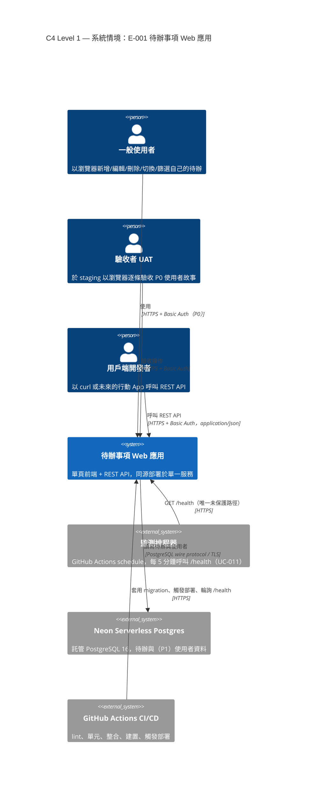
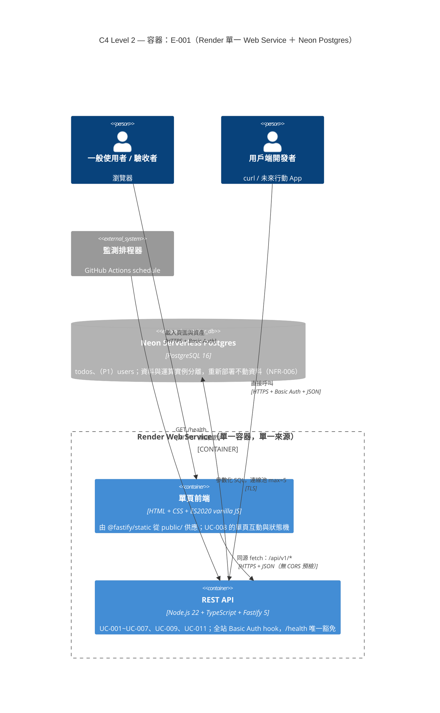

# 系統設計書（SD）：E-001 待辦事項 Web 應用

輸入：`docs/specs/01_需求規格書_SRS.md`（13 則 US、62 條 AC、8 條 NFR）、`docs/specs/02_系統分析書_SA.md`（14 則 UC、32 條 BR、O-001~O-010）、`tasks/E-001-todo-app.md#Leader 裁決紀錄`（Q-001~Q-011、O-001~O-010）。
技術選型一律附 ADR 編號。dev-tl 審核重點：能否據此拆 WBS。

**本書的定位**：回答「用什麼技術、切成哪些模組、每個模組負責什麼」。需求的「為什麼」看 SRS，行為的「是什麼」看 SA 第 5 章 32 條業務規則 —— 本書**不重寫**業務規則，只指定它們落在哪個模組。

**硬約束一覽（全部為 Leader 裁決，不可自行更動）**：

| 約束 | 來源 | 落點 |
|---|---|---|
| Basic Auth 擋整站（頁面 ＋ API），`/health` 豁免且為**唯一**未保護路徑 | Q-008、O-005 | 第 6 章、ADR-0004 |
| 前端與 API **同源**部署 | O-004 | 第 1.2 節、ADR-0004 |
| 識別碼採 **UUID** | O-007 | 第 4 章、ADR-0002 |
| 刪除成功回 **204** | O-001 | 第 5 章、`04_API規格.yaml` |
| 跨使用者存取回 **404** | O-001 | 第 5 章、第 6 章 |
| 狀態變更為**設定目標狀態**（冪等），非切換 | O-002 | 第 5 章、`04_API規格.yaml` |
| 狀態篩選在**後端**做 | O-003 | 第 3 章 `BE-05`／`BE-06` |
| 登出**不需**伺服器端撤銷清單 | O-006 | 第 5 章（P1 無登出端點） |
| `updated_at` 可加，但不得對使用者呈現、不得進 API 回應契約 | O-008 | 第 4 章、`05_資料庫設計.md` |
| CI/CD 用 GitHub Actions | Epic 限制 | `06_部署架構與CICD.md` |

---

## 1. 架構總覽

### 1.1 C4 Level 1（系統情境）



### 1.2 C4 Level 2（容器）

**同源是本圖的重點**：`單頁前端` 與 `REST API` 不是兩個部署單元，而是**同一個 Node.js 程序**下的兩個責任區 —— 靜態檔由 `@fastify/static` 從 `public/` 供應，API 掛在 `/api/v1/*`。因此沒有跨來源請求、沒有 CORS 預檢、沒有「預檢被 Basic Auth 擋成 401」的死結（ADR-0004）。



---

## 2. 技術選型（每項附 ADR）

| 項目 | 選擇 | ADR |
|---|---|---|
| 語言／框架（後端） | Node.js 22 LTS ＋ TypeScript 5.6 ＋ Fastify 5（`@fastify/basic-auth`、`@fastify/static`、P1 `@fastify/jwt`） | ADR-0001 |
| 語言／框架（前端） | 原生 HTML ＋ CSS ＋ ES2020 vanilla JavaScript，**無框架、無打包器** | ADR-0001 |
| 資料庫 | PostgreSQL 16；staging 用 Neon 免費方案，本機用 `postgres:16-alpine` 容器 | ADR-0002 |
| 資料存取 | `pg`（node-postgres）＋ 參數化查詢 ＋ 純 `.sql` 順序 migration（**不用 ORM**） | ADR-0002 |
| 雲端／部署 | Render Web Service（Docker runtime，Free 方案），單一服務同時供應前端與 API | ADR-0003 |
| 認證（P0） | HTTP Basic Auth，應用層全域 hook，`/health` 為唯一豁免路徑 | ADR-0004 |
| 認證（P1） | JWT（`@fastify/jwt`），access token 24h，無 refresh token | ADR-0004、BR-021 |
| CORS | **不啟用**（同源部署）；`CORS_ALLOWED_ORIGINS` 預留但預設留空 | ADR-0004 |
| 日誌 | pino（Fastify 內建），JSON 結構化，含 `reqId` | ADR-0001、BR-014 |
| 測試 | `node:test`（Node 內建測試執行器）＋ `supertest` 風格的 `app.inject()` 整合測試 | 第 7 章 |
| CI/CD | GitHub Actions（Epic 指定） | ADR-0003 |

版本一律釘選主版本，CI 與 Dockerfile 使用**同一個** Node 主版本（22-alpine），避免「最新版」漂移造成不可重現。

---

## 3. 模組設計

模組是**職責單位**，不等於檔案數。`對應 UC` 欄讓 dev-tl 直接反查工作項；`依賴` 欄決定開卡順序。P1 模組標 `(P1)`，Gate 1 不排卡。

### 3.1 後端模組

| 模組 | 職責 | 對應 UC | 介面（輸入／輸出） | 依賴 |
|---|---|---|---|---|
| **BE-01** `app-bootstrap` | 建立 Fastify 實例、依序註冊外掛、讀取並驗證設定（缺必要環境變數即啟動失敗並印出缺哪一個）、註冊優雅關機（`SIGTERM` 時排空連線池） | 全部（基礎設施） | 輸入：環境變數。輸出：已組裝的 Fastify app 實例 | 無 |
| **BE-02** `auth-basic` | 全域 `onRequest` hook：`/health` early-return（**完全相等字串比對**），其餘一律經 `@fastify/basic-auth` 驗證共享帳密；失敗回 401 ＋ `WWW-Authenticate: Basic realm="staging"` | UC-009(E5)、UC-010、UC-011 | 輸入：`Authorization` 標頭、`req.url`。輸出：放行或 401 | BE-01 |
| **BE-03** `http-error-log` | `setErrorHandler` 單點收斂全部錯誤為統一物件 `{code, message, details?, requestId}`；**剝除堆疊／SQL／內部路徑**；5xx 以 error 等級寫 pino 結構化日誌（時間／路徑／方法／訊息／reqId） | UC-009(E4)、全部例外流程 | 輸入：拋出的錯誤 ＋ request 上下文。輸出：JSON 錯誤回應 ＋ 一筆日誌 | BE-01 |
| **BE-04** `todo-api` | 註冊 `/api/v1/todos` 五個端點；以 JSON Schema 做請求驗證（`removeAdditional: true` 實作 BR-012）；序列化回應（`snake_case` → `camelCase` 已在 BE-06 完成，本層只做 schema 過濾） | UC-001~UC-007、UC-009 | 輸入：HTTP 請求。輸出：HTTP 回應（201/200/204/400/404） | BE-03, BE-05 |
| **BE-05** `todo-service` | **業務規則的唯一落點**：BR-001（trim 後非空）、BR-002（≤200）、BR-003（`createdAt` 不可變）、BR-005（排序）、BR-006（布林兩態）、BR-007（不寫 `completedAt`）、BR-008（硬刪除）、BR-009（不存在回 404）、BR-010（篩選三值）、BR-012（僅 title 可編輯）；P1 追加 BR-022／BR-023（先以身分過濾再套篩選） | UC-001~UC-007、UC-014(P1) | 輸入：已驗型別的指令物件。輸出：領域物件或具名錯誤（`NotFoundError`／`ValidationError`） | BE-06 |
| **BE-06** `todo-repository` | 對 `todos` 表的參數化 SQL；**禁止任何字串拼接**；`ORDER BY created_at DESC, id DESC`（tie-break，ADR-0002）；狀態篩選在 **SQL WHERE** 做（O-003）；`snake_case` ↔ `camelCase` 轉換的唯一位置 | UC-001~UC-007 | 輸入：查詢／異動參數。輸出：資料列物件 | BE-08 |
| **BE-07** `health` | `GET /health` → 固定回 `{"status":"ok"}`。**不查資料庫、不回版本號／commit／環境資訊** | UC-011 | 輸入：無。輸出：200 ＋ 固定 JSON | BE-01 |
| **BE-08** `db-migration` | `pg.Pool`（`max: 5`）建立與匯出；migration runner：讀 `migrations/NNN_*.sql` 依序套用，以 `schema_migrations` 記錄版本，**只前進不回退** | UC-010（部署前置） | 輸入：`DATABASE_URL`。輸出：連線池 ＋ 已套用的 schema | 無 |
| **BE-09** `static-hosting` | `@fastify/static` 以 `root: public/` 供應單頁前端；`GET /` 回 `index.html`；**落在 Basic Auth hook 之後**，故靜態檔同樣受保護（Q-008「擋整站」） | UC-008、UC-010 | 輸入：`GET /`、`GET /assets/*`。輸出：靜態檔 | BE-02 |
| **BE-10** `auth-api` (P1) | `POST /api/v1/auth/register`、`POST /api/v1/auth/login`；此兩端點為**公開**（不需 JWT）；登入回 `{token, expiresAt}` | UC-012、UC-013 | 輸入：email／password。輸出：201／200 ＋ JWT | BE-11, BE-03 |
| **BE-11** `user-service` (P1) | BR-018（bcrypt cost 12 單向雜湊）、BR-019（登入失敗訊息不區分帳號不存在與密碼錯誤）、BR-021（JWT 24h 無 refresh）、BR-024（Email 唯一、密碼 ≥ 8） | UC-012、UC-013 | 輸入：註冊／登入指令。輸出：使用者或 JWT | BE-12 |
| **BE-12** `user-repository` (P1) | 對 `users` 表的參數化 SQL；`email` 唯一違反轉為具名錯誤 | UC-012 | 輸入：查詢／異動參數。輸出：資料列物件 | BE-08 |
| **BE-13** `jwt-guard` (P1) | 取代 BE-02：對 `/api/v1/todos*` 驗證 JWT（BR-020），解析出 `userId` 掛在 request 上供 BE-05 使用；`/health` 與 `auth/*` 公開 | UC-013、UC-014 | 輸入：`Authorization: Bearer`。輸出：放行 ＋ `req.userId`，或 401 | BE-01 |

### 3.2 前端模組

前端採**嚴格單向資料流**，這是 BR-011 不被寫成散落 DOM 補丁的唯一保障：
`使用者事件 → controller → api-client → todo-store（唯一可改狀態者）→ todo-view（只讀，整段重繪）`。
**`todo-view` 不得直接呼叫 API，`api-client` 不得碰 DOM。**

| 模組 | 職責 | 對應 UC | 介面（輸入／輸出） | 依賴 |
|---|---|---|---|---|
| **FE-01** `ui-shell` | `public/index.html` ＋ `styles.css`：新增輸入框、篩選控制項、清單容器、載入中指示、錯誤訊息區，**全部在同一頁**（AC-008-1）；響應式版面滿足 1280×800 與 390×844（BR-031） | UC-008 | 輸入：無。輸出：DOM 骨架 ＋ 樣式 | 無 |
| **FE-02** `api-client` | `fetch` 包裝：組 `/api/v1/*` 相對路徑（同源，不寫死網域）、設 `Content-Type`、解析統一錯誤物件並轉為具名例外。**不碰 DOM** | UC-001~UC-007、UC-009 | 輸入：方法 ＋ 路徑 ＋ body。輸出：解析後的資料或具名例外 | 無 |
| **FE-03** `todo-store` | 保存 `{todos, filter, loading, error}`；**唯一可變更狀態的地方**；實作 BR-011（任何異動後以目前 `filter` 重新向後端取清單並整份替換）、BR-010（filter 預設 `all`，不寫網址、不持久化） | UC-001~UC-006 | 輸入：來自 controller 的動作。輸出：新狀態 ＋ 變更通知 | FE-02 |
| **FE-04** `todo-view` | 訂閱 store 變更並重繪清單；**一律以 `textContent` 寫入使用者輸入**（BR-013，禁止 `innerHTML`）；`createdAt` 以 `Intl.DateTimeFormat` 轉瀏覽器本地時區 `yyyy-mm-dd HH:mm`（BR-004）；空狀態提示（BR-028）、載入中指示（BR-030）、錯誤訊息（BR-029）；刪除前二次確認（BR-008）；以 `DocumentFragment` 單次插入（NFR-007） | UC-002、UC-004、UC-007、UC-008 | 輸入：store 狀態。輸出：DOM 更新 | FE-03 |

### 3.3 DevOps 模組

| 模組 | 職責 | 對應 UC | 介面（輸入／輸出） | 依賴 |
|---|---|---|---|---|
| **OPS-01** `container` | 多階段 `Dockerfile`（builder：`npm ci` ＋ `tsc`；runtime：`node:22-alpine`、`npm ci --omit=dev`、非 root 使用者）；`docker-compose.yml` 帶起 `postgres:16-alpine` ＋ app，支撐本機離線驗證與 NFR-008 | UC-010 | 輸入：原始碼。輸出：可執行映像 | BE-01 |
| **OPS-02** `ci-pipeline` | `.github/workflows/ci.yml`：lint → unit → build → integration（以 service container 起 Postgres）。PR 與 push to main 皆觸發；失敗阻擋合併 | UC-010 | 輸入：git 事件。輸出：綠燈／紅燈 | OPS-01 |
| **OPS-03** `deploy-staging` | `infra/render.yaml`（Blueprint，宣告服務型別／region／health check path／環境變數**名稱**）＋ `.github/workflows/deploy-staging.yml`：套用 migration → 觸發 Render Deploy Hook → 輪詢 `/health` 直到 200（逾時即失敗） | UC-010 | 輸入：main 綠燈。輸出：staging 新版本 | OPS-02, BE-08 |
| **OPS-04** `monitor` | `.github/workflows/monitor-health.yml`：`cron: "*/5 * * * *"`，每次連續取樣 3 次（間隔 20 秒）呼叫 `/health`，結果寫入 artifact 供 NFR-003 統計 | UC-011 | 輸入：排程。輸出：成功／失敗紀錄 | OPS-03, BE-07 |

### 3.4 給 dev-tl 的 WBS 建議（P0，符合 Epic「後端 3–5 卡、前端 1–2 卡、DevOps 1–2 卡」）

| 建議卡 | 含括模組 | 為何這樣切 | 前置 |
|---|---|---|---|
| 後端 ① 服務骨架 | BE-01, BE-03, BE-07, BE-09 | 這四個是「沒有它們什麼都跑不起來」的地基，且彼此耦合（錯誤處理器與靜態託管都掛在同一個 app 實例上）。完成後即可 `docker run` 打開空白頁與 `/health` | 無 |
| 後端 ② 資料層 | BE-08, BE-06 | migration 與 repository 是同一組 SQL 心智，一起寫一起測最省來回 | 後端 ① |
| 後端 ③ 待辦 API 與業務規則 | BE-04, BE-05 | 32 條 BR 中的 12 條集中在此，是 CR 與單元測試的主戰場 | 後端 ② |
| 後端 ④ 全站 Basic Auth 與豁免 | BE-02 | **刻意獨立成卡**：它是唯一會「整站不設防」或「NFR-003 永遠不通過」的單點，值得一次獨立的 CR；驗收只有三個 curl，卡小但關鍵 | 後端 ① |
| 前端 ① 版面與 API 用戶端 | FE-01, FE-02 | 無狀態的兩層，可與後端 ③ 並行 | 無（以 mock 開發） |
| 前端 ② 狀態與呈現 | FE-03, FE-04 | BR-011 的單向資料流必須一次做完才驗得出來 | 前端 ①、後端 ③ |
| DevOps ① 容器與 CI | OPS-01, OPS-02 | 本機可 build 是一切的前提，愈早愈好 | 後端 ① |
| DevOps ② 部署與監測 | OPS-03, OPS-04 | 部署與監測共用同一組 secrets 與 `/health` 契約 | DevOps ①、後端 ④ |

**並行建議**：前端 ① 與後端 ②③ 可同時進行；DevOps ① 可在後端 ① 完成後立即開始。關鍵路徑為 後端①→②→③→前端②。

---

## 4. 資料模型

（摘要；完整欄位、索引、DDL 與敏感欄位處理見 `05_資料庫設計.md`）

- **`todos`**（P0 即存在）：`id uuid PK DEFAULT gen_random_uuid()`、`title varchar(200) NOT NULL`（CHECK：trim 後長度 1~200）、`is_completed boolean NOT NULL DEFAULT false`、`created_at timestamptz NOT NULL DEFAULT now()`（不可變，BR-003／I-2）、`updated_at timestamptz NOT NULL DEFAULT now()`（**維運欄位，不進 API 回應契約**，O-008）、`owner_id uuid NULL`（P0 恆為 NULL；P1 起 `NOT NULL` ＋ FK → `users.id`）。
- **`users`**（P1）：`id uuid PK`、`email citext/varchar NOT NULL UNIQUE`（I-5）、`password_hash varchar NOT NULL`（bcrypt cost 12，BR-018）、`created_at timestamptz NOT NULL`。
- **關聯**：`users 1 ── 0..* todos`（P1 起，I-4：每筆 todo 恆有且僅有一個 owner）。
- **`TodoList` 不建表**：SA §3.4 明示它是「某使用者在某篩選下的查詢結果」的名字，不是持久化實體。
- **刻意不存在的欄位**（SA §3.1，防擴大範圍）：`description`、`completed_at`、`due_date`、`priority`、`tags`、`deleted_at`（硬刪除，BR-008）。
- **排序 tie-break**：清單查詢一律 `ORDER BY created_at DESC, id DESC`，使 500 筆同秒建立時順序仍為決定性（ADR-0002 第 2 點）。

---

## 5. API 設計摘要

（完整規格含請求／回應範例與全部錯誤碼見 `04_API規格.yaml`）

路徑前綴 `/api/v1`：Epic 明載「後端要有 API，將來可能接手機 App」，版本前綴現在零成本，日後可免去一次破壞性改名。

| 端點 | 方法 | 對應 UC | 認證 | 成功狀態碼 |
|---|---|---|---|---|
| `/health` | GET | UC-011 | **無（唯一未保護路徑）** | 200 |
| `/`、`/assets/*` | GET | UC-008、UC-010 | Basic Auth（P0） | 200 |
| `/api/v1/todos` | GET | UC-002、UC-006、UC-007 | Basic Auth（P0）／JWT（P1） | 200 |
| `/api/v1/todos` | POST | UC-001 | Basic Auth／JWT | **201** |
| `/api/v1/todos/{id}` | GET | UC-007、UC-009 | Basic Auth／JWT | 200 |
| `/api/v1/todos/{id}` | PATCH | UC-003、UC-005 | Basic Auth／JWT | 200 |
| `/api/v1/todos/{id}` | DELETE | UC-004 | Basic Auth／JWT | **204**（O-001） |
| `/api/v1/auth/register` | POST | UC-012 | 公開（P1） | 201 |
| `/api/v1/auth/login` | POST | UC-013 | 公開（P1） | 200 |

**設計要點（逐條對上裁決與 BR）**：

1. **`PATCH /todos/{id}` 同時服務 UC-003（改標題）與 UC-005（改完成狀態）**，body 為 `{title?: string, isCompleted?: boolean}`，**至少要有一個欄位**否則 400。
   - 這是 O-002「**設定目標狀態**」的實作：送 `{"isCompleted": true}` 是設定目標值，**冪等** —— 重送不會反覆翻轉，前端的失敗重試策略因此可以無腦重送。**不提供 toggle 語意的端點。**
   - BR-012：`id`、`createdAt`、`ownerId`、`updatedAt` 即使被夾帶在 body 中也**一律忽略**（Fastify schema 的 `removeAdditional: true`，是「移除」不是「拒絕」，符合 BR-012 的「忽略」用語）。
2. **`GET /todos?status=all|active|completed`**：三值列舉，預設 `all`，非法值回 400（BR-010、UC-006 E4）。**篩選在後端 SQL 的 WHERE 做**（O-003），前端可對已取得集合做即時過濾以求反應速度，但**事實來源是後端**。
3. **`DELETE` 回 204 No Content，無回應本文**（O-001）。
4. **跨使用者存取回 404**（O-001，P1）：不用 403，避免洩漏「該識別碼是否存在」。P1 實作為「以 `WHERE id = $1 AND owner_id = $2` 查詢，0 列即拋 `NotFoundError`」——**同一條查詢同時完成授權與存在性檢查**，不存在「先查到再判斷權限」的中間狀態，因此 BR-023 的「資料不得被改動」自動成立。
5. **時間格式**：`createdAt` 一律為 RFC 3339／ISO 8601 含時區的字串（例 `2026-09-19T05:29:41.123Z`），UTC（BR-004）。**時區轉換與格式化只發生在前端 FE-04**，API 不提供本地化字串。
6. **識別碼**：`format: uuid`（O-007）。API 路徑參數以 schema 驗證 UUID 格式；格式不合法回 **400**（輸入驗證失敗），格式合法但查無資料回 **404**。這兩者的分界寫死，避免實作者混用。
7. **P1 無登出端點**：O-006 裁決不需伺服器端撤銷清單，登出＝用戶端清除 JWT（AC-012-5）。
8. **回應皆為 `application/json`**（AC-009-3），唯 204 無本文。

---

## 6. 錯誤處理與安全設計

### 6.1 錯誤碼規範

全部錯誤回應為**同一個**結構（BR-014、NFR-005、AC-009-4），由 BE-03 單點產生：

```json
{ "code": "E_VALIDATION", "message": "title must not be empty", "details": { "field": "title" }, "requestId": "req-7f3a2c" }
```

| `code` | HTTP | 何時 | 來源 BR |
|---|---|---|---|
| `E_VALIDATION` | 400 | 標題為空／超過 200 字／`status` 非三值／`id` 非 UUID 格式／PATCH body 無任何可更新欄位 | BR-001、BR-002、BR-010 |
| `E_UNAUTHORIZED` | 401 | 未帶或帶錯 Basic Auth（P0）；未帶／無效／過期 JWT（P1）。**回應不含任何待辦資料** | BR-016、BR-019、BR-020 |
| `E_NOT_FOUND` | 404 | 待辦識別碼不存在；（P1）該筆不屬於當前使用者 | BR-009、BR-023 |
| `E_EMAIL_TAKEN` | 409 | （P1）註冊的 Email 已被使用 | BR-024 |
| `E_INTERNAL` | 500 | 未預期的例外。`message` 為固定字面值 `Internal Server Error`，**不含任何細節** | BR-026、NFR-002② |

- `requestId` 與 pino 日誌的 `reqId` **是同一個值**，這是 NFR-005「可關聯的請求識別碼」的實作方式：使用者回報錯誤時報 `requestId`，維運直接 grep 日誌即可定位。
- **`details` 只出現在 4xx**，且只含欄位名稱與規則，不含使用者輸入原文（避免把注入字串原樣回射）。5xx **一律無 `details`**。

### 6.2 認證／授權

**P0：HTTP Basic Auth 擋整站（Q-008），`/health` 為唯一未保護路徑（O-005）。**

```
BE-02 的全域 onRequest hook：
  1. if (req.url === "/health") return;        ← 唯一豁免，完全相等字串比對
  2. 驗證 Authorization: Basic <base64>
  3. 失敗 → 401 + WWW-Authenticate: Basic realm="staging"
```

**未保護路徑清單（Leader 裁決 O-005 要求明列）：**

| 路徑 | 方法 | 為何未保護 |
|---|---|---|
| `/health` | GET | 監測排程器不持有憑證；不豁免則 AC-010-5 與 NFR-003 永遠不通過（UC-011 E3）。回應為固定 `{"status":"ok"}`，不含業務資料與內部細節 |

**以上為全部。未保護路徑只有這一條。** 新增任何豁免路徑視為**規格變更**，須走規格變更請求任務卡，開發者不得自行決定。

實作硬性要求（CR 判準）：

- 豁免比對**必須是完全相等的字串**，**禁止**前綴比對、萬用字元或正則 —— 前綴比對會讓 `/healthz-secret`、`/health/../api/v1/todos` 之類路徑意外落入豁免。
- hook 掛在**根實例**，涵蓋靜態檔（BE-09）與全部 API 路由。CR 檢查方式：確認 `public/` 下的資產在未帶憑證時同樣回 401。
- 帳密**只**來自環境變數 `BASIC_AUTH_USER`／`BASIC_AUTH_PASSWORD`；**倉庫中不得出現任何值**（BR-016 後半段，阻擋級）。`.env` 必須列入 `.gitignore`，`.env.example` 只寫名稱。
- 比對使用**定時比較**（`crypto.timingSafeEqual`）以避免時序側通道。

**P1：JWT 取代 Basic Auth（BR-020、BR-021）。**

- `/api/v1/todos*` 需 `Authorization: Bearer <jwt>`；`auth/register`、`auth/login` 公開；`/health` 維持公開。
- **移除 Basic Auth 與導入 JWT 必須是同一次部署**，否則中間會出現完全不設防的視窗（見第 9 章）。
- 授權與存在性以**單一查詢**完成（第 5 章第 4 點），不存在「先查到再判斷權限」的中間狀態。

### 6.3 輸入驗證

雙層，且**兩層都不可省**（BR-001 明載前端驗證可被繞過）：

| 層 | 模組 | 做什麼 |
|---|---|---|
| 前端 | FE-03 | 送出前擋空白與超長，即時顯示訊息，不送出請求（UC-001 E1／E2） |
| API schema | BE-04 | JSON Schema：`title` `type: string, minLength: 1, maxLength: 200`；`status` `enum: [all, active, completed]`；`id` `format: uuid`；`removeAdditional: true` |
| 業務層 | BE-05 | `title.trim()` 後再驗一次長度 1~200（schema 的 `minLength` 擋不掉 `"   "`，**這是最常漏的一點**）；PATCH 至少一個可更新欄位 |

- **SQL：一律參數化查詢（`$1`、`$2`），禁止任何字串拼接。** CR 以「repository 層是否出現樣板字串插值進 SQL」為單一判準（ADR-0002）。
- **XSS（BR-013、NFR-002⑤）**：前端一律 `textContent`，**全專案禁止 `innerHTML`**。CR 以 `grep -rn "innerHTML" public/` 應無輸出為判準。

### 6.4 敏感資料處理

| 資料 | 處理 |
|---|---|
| Basic Auth 帳密 | 只在環境變數；**不落日誌**（pino 設 `redact: ["req.headers.authorization"]`）；不進倉庫 |
| `DATABASE_URL` | 同上；錯誤訊息中不得出現（BE-03 剝除，BR-026） |
| 使用者密碼（P1） | bcrypt cost 12 單向雜湊；**明文絕不落庫、絕不落日誌**（BR-018） |
| JWT（P1） | 前端保存；`JWT_SECRET` 只在環境變數；token 本身不落日誌 |
| 待辦標題 | 非敏感，但顯示時一律逸出（BR-013）；4xx 的 `details` 不回射輸入原文 |

### 6.5 日誌與稽核

- pino JSON 結構化日誌輸出至 stdout（容器慣例，由 Render 收集）。
- 每筆請求自動含 `time`、`reqId`、`req.method`、`req.url`、`res.statusCode`、`responseTime`。
- **5xx 以 `error` 等級記錄，含錯誤訊息與堆疊**（堆疊只進日誌，**絕不進回應**）；4xx 以 `warn`。
- `LOG_LEVEL` 由環境變數控制，staging 預設 `info`。
- 不記錄請求本文（避免待辦標題與密碼入日誌）。

---

## 7. 非功能設計（對應 NFR）

| NFR-ID | 設計對策 | 驗證方式 |
|---|---|---|
| **NFR-001** 效能<br>P95 < 500ms／10 併發 | ① Fastify 低額外負擔 ＋ JSON Schema 序列化；② `pg.Pool`（`max: 5`）避免每請求建連線；③ 索引 `(created_at DESC, id DESC)` 讓清單查詢走索引掃描；④ 應用啟動即建池，抵銷 Neon 冷啟；⑤ **OPS-04 的 5 分鐘監測同時具備保溫效果**，使服務不進入 Render Free 的休眠 | `autocannon -c 10 -d 60 -H "Authorization: Basic <base64>" https://<staging>/api/v1/todos`，**先暖身 10 秒再開始取樣**（排除 Neon 冷啟與 Render 喚醒的離群值）；輸出 P95 存入測試報告。建立/更新/刪除另跑一輪，門檻 P95 < 800ms |
| **NFR-002** 安全<br>五項 | ①HTTPS：Render 自動配發憑證並 301 導向（ADR-0003），團隊零程式碼；②不洩漏內部細節：BE-03 單點剝除堆疊/SQL/路徑，5xx 訊息為固定字面值；③bcrypt cost 12（P1）；④JWT 保護全部待辦端點（P1，BE-13）；⑤前端全面 `textContent`，禁 `innerHTML` | ①`curl -sSI http://<staging>` 觀察 301 ＋ 瀏覽器檢視憑證；②對 5 種錯誤情境打 API 檢視回應本文；③查 `users` 表 `password_hash` 欄位值；④無 token 呼叫五個端點皆 401；⑤建立標題為 `<script>alert(1)</script>` 的待辦，頁面無彈窗且文字原樣顯示。**另：`grep -rn "innerHTML" public/` 應無輸出**；**`curl -sSI -u ... /api/v1/todos \| grep -i access-control-allow-origin` 應無輸出**（AC-009-5 判準，ADR-0004 第 6 點） |
| **NFR-003** 可用性<br>成功率 ≥ 99%；部署不可用 < 60 秒 | ① `/health` 豁免 Basic Auth（BR-017、O-005），監測器不需憑證；② `/health` **不查資料庫**，只回程序存活，避免資料庫抖動造成誤判與不必要的實例重啟；③ Render health check path 設為 `/health`，**新實例通過健康檢查才切流量、舊實例才下線**（零停機輪替）；④ OPS-04 每 5 分鐘取樣（< Render Free 的 15 分鐘休眠門檻，兼作保溫）；⑤ 部署工作流在觸發後輪詢 `/health` 直到 200，逾時即判失敗 | **Gate 2 採 24 小時採樣**（Leader 對 O-009 的裁決；連續 7 天為正式環境目標，不作 Gate 2 門檻）：OPS-04 的 artifact 統計成功／總取樣次數，門檻 ≥ 99%。部署中斷時長：部署期間以每 5 秒一次輪詢記錄連續失敗時長，門檻 < 60 秒。**判讀規則**：若未達標，須先區分是應用缺陷還是 Render Free 休眠／平台事件，再決定是否升級方案（ADR-0003） |
| **NFR-004** 相容性<br>3 瀏覽器 × 2 尺寸 | ① 前端無框架、無打包器，目標 ES2020，只用各瀏覽器皆穩定支援的 API（`fetch`、`Intl.DateTimeFormat`、CSS flexbox）；② 版面以 flexbox ＋ 單一 `@media` 斷點（768px）處理 390×844，控制項最小點擊區 44×44 px，**不使用橫向捲動**（BR-031） | 依相容性檢查表 3×2 = 6 組，逐組實際操作一次 US-001~US-007 完整流程，每組記錄通過／不通過與截圖，存入測試報告（qa-at） |
| **NFR-005** 可維運性<br>統一錯誤結構 ＋ 5xx 結構化日誌 | ① BE-03 為**唯一**的錯誤出口，結構不可能不一致；② pino 預設即輸出含 `reqId` 的 JSON；③ **回應的 `requestId` 與日誌的 `reqId` 是同一值**，可直接關聯 | 觸發 1 個 4xx 與 1 個 5xx，比對兩者回應結構是否同形；取回應中的 `requestId`，在服務日誌中 grep 到同一筆並確認含時間／路徑／方法／錯誤訊息五項。結果貼入 CR 紀錄 |
| **NFR-006** 資料持久性<br>重啟／重新部署後 100% 仍在 | **由架構保證，不依賴腳本正確性**：資料庫是外部託管的 Neon Postgres，與 Render 運算實例**完全分離**，重新部署只換運算容器，不觸碰資料（ADR-0002）。migration 為 forward-only，不會在部署時刪表 | 建立 10 筆待辦 → 觸發一次重新部署 → 呼叫清單 API 比對 10 筆的 `id` 與 `title` 皆一致，輸出比對結果 |
| **NFR-007** 容量<br>500 筆下 API < 2 秒、前端可操作 < 3 秒 | ① 索引 `(created_at DESC, id DESC)` 支撐排序與 tie-break；② **不分頁、不搜尋**（BR-027，範圍外），500 筆的 JSON 約 100 KB，單次回傳可接受；③ 前端以 `DocumentFragment` 組完整清單後**單次插入**，只觸發一次重排 | 以腳本建立 500 筆後，`curl -w "%{time_total}"` 量測清單 API；瀏覽器 DevTools Performance 量測可互動時間。**因 tie-break 已定（`created_at DESC, id DESC`），同秒建立的 500 筆順序仍為決定性，斷言可寫死** |
| **NFR-008** 可安裝性<br>15 分鐘、卡關點 0 | ① `docker compose up` 一行同時帶起 `postgres:16-alpine` 與應用，無需本機安裝 Node 或 Postgres；② `.env.example` 列齊全部變數名稱與說明，複製即可用；③ README **同時提供 Git Bash 與 PowerShell 兩種寫法**（Epic 限制）；④ migration 於應用啟動時自動套用，使用者不需手動執行 | 由 qa-at 依 README 逐步實作並計時，記錄耗時與卡關點；判準為總耗時 ≤ 15 分鐘且卡關點為 0 |

---

## 8. 目錄結構與分支策略（給 dev-tl）

### 8.1 目錄結構

```
.
├── .github/
│   └── workflows/
│       ├── ci.yml                     # OPS-02：lint / unit / build / integration
│       ├── deploy-staging.yml         # OPS-03：migration → deploy hook → 輪詢 /health
│       └── monitor-health.yml         # OPS-04：cron */5，取樣 3 次
├── infra/
│   └── render.yaml                    # OPS-03：Render Blueprint（IaC，只含變數名稱）
├── migrations/
│   ├── 001_create_todos.sql           # BE-08
│   └── 002_create_users_and_owner.sql # BE-08（P1）
├── public/                            # FE：@fastify/static 的 root，同源供應
│   ├── index.html                     # FE-01
│   ├── styles.css                     # FE-01
│   └── assets/
│       ├── api-client.js              # FE-02
│       ├── todo-store.js              # FE-03
│       └── todo-view.js               # FE-04
├── src/
│   ├── server.ts                      # BE-01：啟動、監聽、優雅關機
│   ├── app.ts                         # BE-01：組裝 Fastify 實例與外掛註冊順序
│   ├── config.ts                      # BE-01：讀取並驗證環境變數
│   ├── plugins/
│   │   ├── basic-auth.ts              # BE-02（唯一豁免路徑在此）
│   │   ├── error-handler.ts           # BE-03
│   │   └── static.ts                  # BE-09
│   ├── routes/
│   │   ├── health.ts                  # BE-07
│   │   ├── todos.ts                   # BE-04
│   │   └── auth.ts                    # BE-10（P1）
│   ├── services/
│   │   ├── todo-service.ts            # BE-05（12 條 BR 的落點）
│   │   └── user-service.ts            # BE-11（P1）
│   ├── repositories/
│   │   ├── todo-repository.ts         # BE-06
│   │   └── user-repository.ts         # BE-12（P1）
│   ├── db/
│   │   ├── pool.ts                    # BE-08
│   │   └── migrate.ts                 # BE-08
│   └── schemas/
│       ├── todo-schema.ts             # BE-04：與 04_API規格.yaml 共用同一套 JSON Schema
│       └── error-schema.ts            # BE-03
├── tests/
│   ├── unit/                          # todo-service 的 BR 逐條測試
│   └── integration/                   # app.inject()：端點 + 狀態碼 + 錯誤結構 + Basic Auth
├── docs/                              # 本規格包（已存在）
├── .env.example                       # 只有名稱與說明，無值
├── .gitignore                         # 必含 .env
├── Dockerfile                         # OPS-01：多階段，runtime 為 node:22-alpine 非 root
├── docker-compose.yml                 # OPS-01：app + postgres:16-alpine
├── package.json
├── tsconfig.json
└── README.md                          # NFR-008：Git Bash 與 PowerShell 兩種寫法
```

**外掛註冊順序（`src/app.ts`，順序錯了會出安全漏洞，不可調換）**：

1. `error-handler`（BE-03）—— 最先，之後任何一步拋錯都被它接住
2. `basic-auth` 全域 hook（BE-02）—— **必須早於 static 與 routes**，否則靜態檔不設防
3. `health` 路由（BE-07）
4. `static`（BE-09）
5. `todos` 路由（BE-04）
6. （P1）`jwt-guard`（BE-13）取代第 2 步；`auth` 路由（BE-10）

### 8.2 分支策略

- `main` 受保護：禁止直推；合併需 PR ＋ CI 全綠（lint／unit／build／integration 四階段）。
- 每張開發卡一條分支：`task/T-####-slug`（例 `task/T-0011-todo-api`）。
- 合併由 **dev-tl** 執行，合併後更新 CHANGELOG。
- 文件卡（規劃階段）直接 commit 到 `main`。
- **commit 訊息**：`T-####: 摘要`，結尾一行 `Co-Authored-By`，署實際執行該卡的模型。
- 合併到 `main` 且 CI 全綠即自動觸發 `deploy-staging.yml`；prod 部署為手動（本 Epic 無 prod）。
- **禁止 commit**：`.env`、任何憑證、`node_modules/`、`dist/`。

---

## 9. 開放問題

| # | 問題 | 現況／我的處理 | 交付對象 |
|---|---|---|---|
| SD-01 | **P1 切換的原子性**：移除 Basic Auth 與導入 JWT 若分兩次部署，中間會出現一段完全不設防的視窗 | 設計上規定**必須同一次部署**（第 6.2 節）。已寫入本書，P1 開卡時 dev-tl 須把兩者放進同一張卡或同一個 PR | dev-tl（P1 開卡時） |
| SD-02 | **P1 資料清空的執行者與時機**：BR-032／Q-011 裁決「導入 P1 時直接清空 staging 既有待辦資料」，但未指定由誰在哪一步執行 | 建議做成 `002_*.sql` migration 內、**`ALTER ... SET NOT NULL` 之前**的 `TRUNCATE todos;`，與加 `owner_id NOT NULL` 同一個 migration，使其不可能被遺漏。**屬 P1，Gate 1 不受影響** | dev-ops（P1） |
| SD-03 | **`E_EMAIL_TAKEN` 使用 409**：AC-009-3 列舉的狀態碼未含 409，但該 AC 的實質要求是「語意正確」，重複 Email 用 409 Conflict 語意最準 | 本書採 **409**。若 plan-ba 或測試團隊認為須嚴格限縮於 AC-009-3 的列舉值，改為 `400 E_EMAIL_TAKEN` 是單點變更（只動一個常數）。**屬 P1，Gate 1 不受影響** | plan-ba（T-0005）／測試團隊 |
| SD-04 | **Render Free 冷啟的殘留風險**：若 OPS-04 監測工作流本身失效超過 15 分鐘，下一次請求會遇到 30–50 秒冷啟，該次 P95 遠超 NFR-001 | 已在 ADR-0003 明確承擔；NFR-001 量測規定先暖身 10 秒；`06_部署架構與CICD.md` 第 6 章把冷啟列為已知告警誤報來源。**不隱藏、不假裝沒有** | dev-ops、qa-lead |
| SD-05 | **`/api/v1` 版本前綴**：SRS 未要求版本化 | 本書採用，理由見第 5 章（Epic 明載「將來可能接手機 App」，現在零成本）。若審核者認為屬擴大範圍，移除前綴是單點變更（`04_API規格.yaml` 與 `routes/todos.ts` 的 prefix 各一處） | plan-sa（本卡審核者） |
