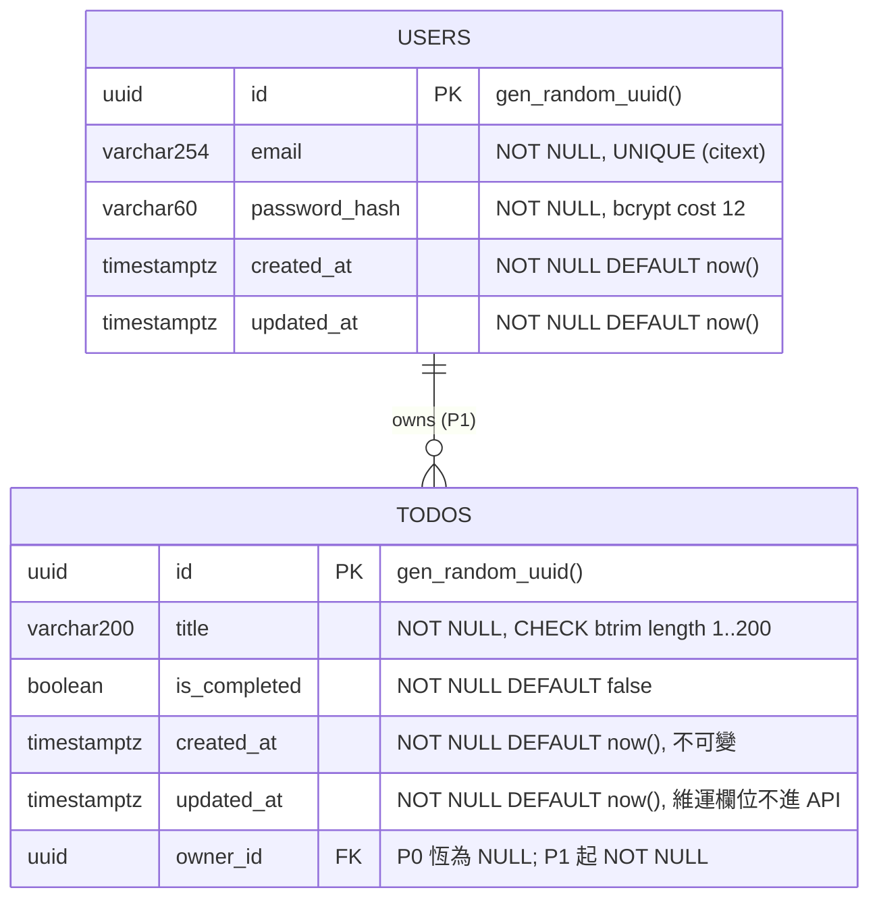

# 資料庫設計：E-001 待辦事項 Web 應用

產品：**PostgreSQL 16**。staging 為 Neon Serverless Postgres 免費方案，本機為 `postgres:16-alpine` 容器（**同一個主版本、同一種方言**，無 dev/prod 漂移）。存取方式為 `pg`（node-postgres）＋ 參數化查詢 ＋ 純 `.sql` 順序 migration，**不使用 ORM**。選型理由與被淘汰的選項見 `adr/ADR-0002-資料庫.md`。

來源：`docs/specs/02_系統分析書_SA.md` 第 3 章領域模型（實體屬性表、§3.4 五條不變量）、Leader 裁決 O-007（UUID）、O-008（`updated_at` 可加但不進 API 契約）、Q-003（硬刪除）、Q-006（不記錄完成時間）。

---

## 1. ERD

`(P1)` 標記者為 P1 階段才建立。P0 的 `todos.owner_id` 欄位**存在但恆為 NULL**，P1 的 migration 才補上 `NOT NULL` 與外鍵。



**`TodoList` 不建表**：SA §3.4 明示它是「某使用者在某篩選下的查詢結果」的名字，不是持久化實體。任何在此處建表的設計都是誤讀。

---

## 2. 資料表

### todos

| 欄位 | 型別 | 約束 | 說明 | 來源實體 |
|---|---|---|---|---|
| `id` | `uuid` | `PRIMARY KEY DEFAULT gen_random_uuid()` | 系統產生、不可重用、對使用者唯讀。**UUID 而非自增整數**：P0 的 staging 只有一層共享 Basic Auth，自增整數容易被逐號列舉（Leader 裁決 O-007） | `Todo.id` |
| `title` | `varchar(200)` | `NOT NULL` ＋ `CHECK (char_length(btrim(title)) BETWEEN 1 AND 200)` | 待辦標題。**`CHECK` 用 `btrim` 而非直接比長度**：全為空白字元的字串（例如 `'   '`）長度是 3 但去空白後是 0，必須被擋下（BR-001） | `Todo.title` |
| `is_completed` | `boolean` | `NOT NULL DEFAULT false` | 完成狀態，僅兩態無第三態（BR-006、不變量 I-3）。用 `boolean` 而非列舉，語意上是狀態、儲存上是布林（SA §3.2） | `Todo.isCompleted` |
| `created_at` | `timestamptz` | `NOT NULL DEFAULT now()` | 建立時間，UTC。**一經寫入不再改變**（BR-003、不變量 I-2），由第 3 章的觸發器強制 | `Todo.createdAt` |
| `updated_at` | `timestamptz` | `NOT NULL DEFAULT now()` | **維運欄位**（Leader 裁決 O-008）。不呈現給使用者、**不出現在 `04_API規格.yaml` 的 `Todo` schema**。用途僅限於維運排查與資料稽核 | 無（SRS 未要求） |
| `owner_id` | `uuid` | P0：`NULL`（無外鍵）<br>P1：`NOT NULL REFERENCES users(id) ON DELETE CASCADE` | 所屬使用者。P0 恆為 NULL；P1 的 `002` migration 先 `TRUNCATE` 再改為 `NOT NULL`（BR-032、Leader 裁決 Q-011：導入 P1 時直接清空 staging 既有資料，不做歸屬遷移） | `Todo.ownerId` |

**刻意不存在的欄位**（SA §3.1 明列，防下游擴大範圍）：

| 不存在的欄位 | 為什麼 |
|---|---|
| `description` / 備註 | Leader 裁決 Q-002：P0 只有「標題」一個可編輯欄位 |
| `completed_at` / 完成時間 | Leader 裁決 Q-006：不記錄、不顯示（BR-007） |
| `deleted_at` / 軟刪除旗標 | Leader 裁決 Q-003：**硬刪除**，資料不保留、不可復原（BR-008）。出現此欄位即與裁決不符 |
| `due_date`、`priority`、`tags`、`sort_order` | 全部為 SRS 範圍外；`sort_order` 另違反 Q-005（使用者不可調整排序） |

索引：

| 索引 | 定義 | 為什麼 |
|---|---|---|
| `todos_pkey` | `PRIMARY KEY (id)` | 單筆讀取／更新／刪除（UC-003 ~ UC-005、UC-009） |
| `idx_todos_created_at_desc` | `(created_at DESC, id DESC)` | **P0 清單查詢的主索引**。BR-005 要求「建立時間由新到舊」；加上 `id` 作為次要排序鍵後，即使兩筆時間戳完全相同（NFR-007 的 500 筆以腳本批次建立時極易發生），順序仍為**決定性**，測試斷言可以寫死。這是收斂 T-0003 審核時記下的 tie-break 瑕疵 |
| `idx_todos_owner_created` (P1) | `(owner_id, created_at DESC, id DESC)` | BR-022 要求「先以使用者身分過濾，再套狀態篩選」。前導欄位為 `owner_id`，讓過濾與排序走同一個索引 |

**刻意不建的索引**：`is_completed` **不另建索引**。500 筆的資料量（NFR-007 上限）下，布林欄位的選擇度只有 2，索引不會被規劃器採用，只會增加每次寫入的維護成本。狀態篩選以 `WHERE` 條件在既有的排序索引掃描結果上過濾即可。

### users（P1）

| 欄位 | 型別 | 約束 | 說明 | 來源實體 |
|---|---|---|---|---|
| `id` | `uuid` | `PRIMARY KEY DEFAULT gen_random_uuid()` | 系統產生 | `User.id` |
| `email` | `citext` | `NOT NULL UNIQUE`，`CHECK (char_length(email) <= 254)` | 帳號識別，**全系統唯一**（不變量 I-5、BR-024）。用 `citext`（大小寫不敏感）而非 `varchar`：`Alice@example.com` 與 `alice@example.com` 必須視為同一個帳號，否則 BR-024 的唯一性可被大小寫繞過。**不寄驗證信**（Leader 裁決 Q-009），Email 僅作唯一識別 | `User.email` |
| `password_hash` | `varchar(60)` | `NOT NULL` | bcrypt 雜湊值（固定 60 字元）。cost **12**（BR-018 要求 ≥ 10，取 12 留餘裕）。**明文絕不落庫**（NFR-002③、AC-011-4） | `User.passwordHash` |
| `created_at` | `timestamptz` | `NOT NULL DEFAULT now()` | 建立時間，UTC，對齊 `todos` 的時間處理 | `User.createdAt` |
| `updated_at` | `timestamptz` | `NOT NULL DEFAULT now()` | 維運欄位，不進 API 契約 | 無 |

索引：

| 索引 | 定義 | 為什麼 |
|---|---|---|
| `users_pkey` | `PRIMARY KEY (id)` | JWT 解析後以 `sub` 反查使用者 |
| `users_email_key` | `UNIQUE (email)` | 由 `UNIQUE` 約束自動建立。登入查詢（`WHERE email = $1`）與唯一性檢查共用同一個索引 |

**刻意不存在的欄位**：`email_verified`（Q-009 裁決不寄驗證信）、`refresh_token` 相關欄位（Q-010 裁決無 refresh token）、`revoked_tokens` 表（Leader 裁決 O-006：登出不需伺服器端撤銷清單）。

### schema_migrations

| 欄位 | 型別 | 約束 | 說明 |
|---|---|---|---|
| `version` | `text` | `PRIMARY KEY` | migration 檔名的數字前綴，例如 `001` |
| `applied_at` | `timestamptz` | `NOT NULL DEFAULT now()` | 套用時刻 |

---

## 3. DDL / Migration 草案

策略：檔名 `NNN_描述.sql` 順序遞增，**只前進不回退（forward-only）**。程式碼回滾（見 `06_部署架構與CICD.md` 第 5 章）**不需要**回滾資料庫 —— 這是刻意的設計，因為免費方案沒有可靠的時間點還原，能回滾的東西反而更容易在慌亂中把資料弄丟。

### `migrations/001_create_todos.sql`（P0）

```sql
-- 001_create_todos.sql
-- P0：待辦事項主表。對應 SA §3.1 Todo 實體。

-- gen_random_uuid() 自 PostgreSQL 13 起為內建函式，不需 CREATE EXTENSION pgcrypto。
CREATE TABLE IF NOT EXISTS todos (
    id            uuid         PRIMARY KEY DEFAULT gen_random_uuid(),
    title         varchar(200) NOT NULL,
    is_completed  boolean      NOT NULL DEFAULT false,
    created_at    timestamptz  NOT NULL DEFAULT now(),
    updated_at    timestamptz  NOT NULL DEFAULT now(),
    owner_id      uuid         NULL,           -- P0 恆為 NULL；P1 於 002 改為 NOT NULL + FK

    -- BR-001 / BR-002 / 不變量 I-1：去除前後空白後長度必須在 1..200。
    -- 用 btrim 而非直接比長度，否則 '   ' 這種全空白字串會通過檢查。
    CONSTRAINT todos_title_not_blank
        CHECK (char_length(btrim(title)) BETWEEN 1 AND 200)
);

-- BR-005 清單排序（建立時間由新到舊）+ id 作為 tie-break，使順序為決定性。
CREATE INDEX IF NOT EXISTS idx_todos_created_at_desc
    ON todos (created_at DESC, id DESC);

-- BR-003 / 不變量 I-2：created_at 一經寫入不再改變。
-- 應用層已不送 created_at，此觸發器是第二道防線（防手動 SQL 或未來的程式碼疏漏）。
-- 同時自動維護 updated_at，應用層不需關心。
CREATE OR REPLACE FUNCTION todos_protect_created_at()
RETURNS trigger AS $$
BEGIN
    NEW.created_at := OLD.created_at;   -- 強制還原，任何改動嘗試都靜默失效
    NEW.updated_at := now();
    RETURN NEW;
END;
$$ LANGUAGE plpgsql;

DROP TRIGGER IF EXISTS trg_todos_protect_created_at ON todos;
CREATE TRIGGER trg_todos_protect_created_at
    BEFORE UPDATE ON todos
    FOR EACH ROW EXECUTE FUNCTION todos_protect_created_at();
```

### `migrations/002_create_users_and_owner.sql`（P1）

```sql
-- 002_create_users_and_owner.sql
-- P1：使用者表，並把 todos.owner_id 升為必填外鍵。

CREATE EXTENSION IF NOT EXISTS citext;   -- email 需大小寫不敏感的唯一性

CREATE TABLE IF NOT EXISTS users (
    id            uuid        PRIMARY KEY DEFAULT gen_random_uuid(),
    email         citext      NOT NULL UNIQUE,
    password_hash varchar(60) NOT NULL,              -- bcrypt cost 12，固定 60 字元
    created_at    timestamptz NOT NULL DEFAULT now(),
    updated_at    timestamptz NOT NULL DEFAULT now(),

    CONSTRAINT users_email_length CHECK (char_length(email) <= 254)
);

-- BR-032 / Leader 裁決 Q-011：導入 P1 時直接清空 staging 既有待辦資料，不做歸屬遷移。
-- 刻意與「owner_id 改為 NOT NULL」放在同一個 migration，使其不可能被遺漏
-- （若分開執行，既有的無主資料會讓 ALTER 失敗，或留下違反 BR-023 的孤兒列）。
TRUNCATE TABLE todos;

ALTER TABLE todos
    ALTER COLUMN owner_id SET NOT NULL,
    ADD CONSTRAINT todos_owner_fk
        FOREIGN KEY (owner_id) REFERENCES users(id) ON DELETE CASCADE;

-- BR-022：先以使用者身分過濾，再套狀態篩選與排序 —— 前導欄位必須是 owner_id。
CREATE INDEX IF NOT EXISTS idx_todos_owner_created
    ON todos (owner_id, created_at DESC, id DESC);

-- P0 的通用排序索引在 P1 已無查詢會單獨使用（所有查詢都帶 owner_id），移除以省寫入成本。
DROP INDEX IF EXISTS idx_todos_created_at_desc;
```

### migration runner（`src/db/migrate.ts` 的行為規格）

1. 建立 `schema_migrations (version text PRIMARY KEY, applied_at timestamptz NOT NULL DEFAULT now())`（若不存在）。
2. 讀取 `migrations/` 下所有 `.sql`，依檔名排序。
3. 對每個尚未出現在 `schema_migrations` 的版本：**在單一交易內**執行該檔全文，成功後寫入 `schema_migrations`，再 commit。任一檔失敗即 rollback 該檔並讓整個程序以非 0 結束（部署工作流據此中止，保留前一版可用）。
4. 於**應用啟動時自動執行**（NFR-008：使用者不需手動下 migration 指令），亦可由 CI 的部署工作流在觸發部署前單獨執行。
5. **只前進不回退**：runner 不提供 `down`。

### 代表性查詢（`todo-repository` 的 SQL，全部參數化）

```sql
-- 清單查詢（UC-002 / UC-006 / UC-007）。$1 = 'all' | 'active' | 'completed'
-- 篩選在後端 SQL 做（Leader 裁決 O-003）；排序含 tie-break。
SELECT id, title, is_completed, created_at
  FROM todos
 WHERE ($1 = 'all')
    OR ($1 = 'active'    AND is_completed = false)
    OR ($1 = 'completed' AND is_completed = true)
 ORDER BY created_at DESC, id DESC;

-- 建立（UC-001）。id / created_at 由資料庫產生，應用層不送。
INSERT INTO todos (title) VALUES (btrim($1))
RETURNING id, title, is_completed, created_at;

-- 更新標題與／或完成狀態（UC-003 / UC-005）。
-- COALESCE 讓兩個欄位皆為選填；isCompleted 是「設定目標狀態」而非 toggle（O-002），故為冪等。
UPDATE todos
   SET title        = COALESCE(btrim($2), title),
       is_completed = COALESCE($3, is_completed)
 WHERE id = $1
RETURNING id, title, is_completed, created_at;

-- 刪除（UC-004）。硬刪除，回 204；影響列數為 0 即回 404（BR-008 / BR-009）。
DELETE FROM todos WHERE id = $1;

-- P1 的單筆存取（UC-014）：授權與存在性以同一條查詢完成，
-- 因此不存在「先查到再判斷權限」的中間狀態，BR-023 的「資料不得被改動」自動成立。
-- 0 列即回 404（而非 403，Leader 裁決 O-001）。
SELECT id, title, is_completed, created_at
  FROM todos
 WHERE id = $1 AND owner_id = $2;
```

**硬性規則（CR 單一判準）**：repository 層**禁止任何形式的 SQL 字串拼接或樣板字串插值**，一律使用 `$1`、`$2` 參數化。qa-cr 的檢查方式是看 repository 檔案中 SQL 字串內有無 `${`。

---

## 4. 資料保留與敏感欄位

### 4.1 資料保留

| 資料 | 保留策略 |
|---|---|
| `todos` | **硬刪除，不可復原**（BR-008、Leader 裁決 Q-003）。無軟刪除、無回收桶、無備份還原流程（範圍外） |
| `todos`（P1 導入時） | 一次性 `TRUNCATE`（BR-032、Q-011），不做歸屬遷移 |
| `users`（P1） | 刪除使用者時其待辦以 `ON DELETE CASCADE` 一併刪除（與硬刪除策略一致） |
| 備份 | Neon 免費方案提供的時間點還原能力**不納入本設計的保證**。NFR-006 要求的是「重啟／重新部署後資料仍在」，由「資料庫與運算實例分離」的架構滿足，**不依賴備份** |

### 4.2 敏感欄位

| 欄位 | 敏感等級 | 處理（加密／遮罩／不落日誌） |
|---|---|---|
| `users.password_hash`（P1） | **高** | bcrypt cost 12 單向雜湊，**不可逆**；明文密碼絕不落庫、絕不落日誌、絕不進任何 API 回應（BR-018、NFR-002③、AC-011-4）。`04_API規格.yaml` 的 `User` schema 以 `additionalProperties: false` 從契約層面保證它不會被序列化出去 |
| `users.email`（P1） | 中（個資） | 明文儲存（登入查詢需要）。**不進日誌**；錯誤訊息不回射（BR-019 的統一失敗訊息同時也避免了 Email 存在與否的洩漏） |
| `todos.title` | 低 | 明文儲存。顯示時一律逸出（BR-013）；4xx 的 `details` **不回射輸入原文**，避免把注入字串原樣送回 |
| `todos.id`、`users.id` | 低 | UUID，本身不可猜測（O-007），可安全出現在網址與日誌 |
| `DATABASE_URL`（連線字串，含密碼） | **高** | 只存在於環境變數／平台 secrets；**不進倉庫**；pino 設 `redact` 不落日誌；錯誤處理器（BE-03）剝除所有含連線資訊的錯誤訊息（BR-026） |
| Basic Auth 帳密 | **高** | 只存在於環境變數；pino `redact: ["req.headers.authorization"]`；不進倉庫（BR-016，違反即阻擋級安全缺陷） |

### 4.3 容量估算

| 項目 | 估算 |
|---|---|
| 單筆 `todos` 列 | 約 250 bytes（UUID 16B ＋ 標題最長 200 字元的 UTF-8 ＋ 三個時間戳與布林） |
| NFR-007 的上限 500 筆 | 約 **125 KB**（含索引不超過 500 KB） |
| Neon 免費方案上限 | 0.5 GB —— 餘裕約 1000 倍，**不需監控儲存用量**，也不需要設計歸檔機制 |
